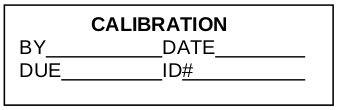
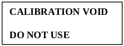
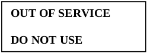

# NAL Quality System Manual

>Most recently edited by: *Paul VanderWeele*  
>Most recent edit date: *Dec 29, 2020*  
>Edits were authorized by: *Scott Wall*  

# Table of Contents

  [**Introduction**](#introduction)  

 1. [**Scope**](#1-scope)

 2. [**References and Distribution Control**](#2-references-and-distribution-control)  

 3. [**Terms and Definitions**](#3-terms-and-definitions)

 4. [**General Requirements**](#4-general-requirements)  
  [4.1 **Impartiality**](#41-impartiality)  
  [4.1.1 Laboratory Impartiality](#411-laboratory-impartiality)  
  [4.1.2 Management Impartiality](#412-management-impartiality)  
  [4.1.3 Impartiality to Pressure](#413-impartiality-to-pressure)  
  [4.1.4 Risk Identification](#414-risk-identification)  
  [4.1.5 Risk Followup Procedure](#415-risk-followup-procedure)  
  [4.2 **Confidentiality**](#42-confidentiality)  
  [4.2.1 Confidentiality of Information](#421-confidentiality-of-information)  
  [4.2.2 Release of Information](#422-release-of-information)  
  [4.2.3 Sourcing of Information](#423-sourcing-of-information)  
  [4.2.4 Personnel Confidentiality](#424-personnel-confidentiality)  

 5. [**Structural Requirements**](#5-structural-requirements)  
  [5.1 **Legal Entity**](#51-legal-entity)  
  [5.2 **Management Responsible for Laboratory**](#52-management-responsible-for-laboratory)  
  [5.3 **Scope of Accredited Laboratory Activities**](#53-scope-of-accredited-laboratory-activities)  
  [5.4 **Laboratory Requirements**](#54-laboratory-requirements)  
  [5.5 **Laboratory Organizational Structure and Procedures**](#55-laboratory-organizational-structure-and-procedures)  
  [5.6 **Personnel Responsibility and Authority**](#56-personnel-responsibility-and-authority)  
  [5.7 **Communication and Integrity of the Management System**](#57-communication-and-integrity-of-the-management-system)  

6. [**Resource Requirements**](#6-resource-requirements)  
  [6.1 **General**](#61-general)  
  [6.2 **Personnel**](#62-personnel)  
  [6.2.1 **Personnel**](#621-personnel)  
  [6.2.2 **Competence Requirements**](#622-competence-requirements)  
  [6.2.3 **Personnel Competence**](#623-personnel-competence)  
  [6.2.4 **Communication of Duties, Responsibilities, and Authorities**](#624-communication-of-duties-responsibilities-and-authorities)  
  [6.2.5 **Personnel Procedures**](#625-personnel-procedures)  
  [6.2.6 **Personnel Authorization**](#626-personnel-authorization)  
  [6.3 **Facilities and Environmental Conditions**](#63-facilities-and-environmental-conditions)  
  [6.3.1 **Suitability of Facilities and Environmental Conditions**](#631-suitability-of-facilities-and-environmental-conditions)  
  [6.3.2 **Documentation of Requirements for Facilities and Environmental Conditions**](#632-documentation-of-requirements-for-facilities-and-environmental-conditions)  
  [6.3.3 **Monitoring, Controlling, and Recording Environmental Conditions**](#633-monitoring-controlling-and-recording-environmental-conditions)  
  [6.3.4 **Measures to Control Facilities**](#634-measures-to-control-facilities)  
  [6.3.5 **Work Performed Outside the Laboratory's Permanent Control**](#635-work-performed-outside-the-laboratorys-permanent-control)  
  [6.4 **Equipment**](#64-equipment)  
  [6.4.1 **Access to Laboratory Equipment**](#641-access-to-laboratory-equipment)  
  [6.4.2 **Equipment Outside the Laboratory's Permanent Control**](#642-equipment-outside-the-laboratorys-permanent-control)  
  [6.4.3 **Procedure for Handling, Transport, Storage, Use, and Planned Maintenance of Equipment**](#643-procedure-for-handling-transport-storage-use-and-planned-maintenance-of-equipment)  
  [6.4.4 **Verification of Equipment Prior to Use or Re-Use**](#644-verification-of-equipment-prior-to-use-or-re-use)  
  [6.4.5 **Equipment Accuracy/Uncertainty**](#645-equipment-accuracyuncertainty)  
  [6.4.6 **Equipment Calibration**](#646-equipment-calibration)  
  [6.4.7 **Calibration Program**](#647-calibration-program)  
  [6.4.8 **Calibration Status**](#648-calibration-status)  
  [6.4.9 **Out of Service**](#649-out-of-service)  
  [6.4.10 **Calibration Confirmation**](#6410-calibration-confirmation)  
  [6.4.11 **Correction Factors**](#6411-correction-factors)  
  [6.4.12 **Safeguards**](#6412-safeguards)  
  [6.4.13 **Equipment Records**](#6413-equipment-records)  
  [6.5 **Metrological Traceability**](#65-metrological-traceability)  
  [6.5.1 **Establishing and Maintaining Metrological Traceability**](#651-establishing-and-maintaining-metrological-traceability)  
  [6.5.2 **Ensuring Measurement Results are Traceable**](#652-ensuring-measurement-results-are-traceable)  
  [6.5.3 **Non-traceability of Reference Standards to SI Units**](#653-non-traceability-of-reference-standards-to-si-units)  
  [6.6 **Externally Provided Products and Services**](#66-externally-provided-products-and-services)  
  [6.6.1 **Suitability of Externally Provided Products and Services**](#661-suitability-of-externally-provided-products-and-services)  
  [6.6.2 **Purchasing Services and Supplies**](#662-purchasing-services-and-supplies)  
  [6.6.3 **Communicating Requirements to External Providers**](#663-communicating-requirements-to-external-providers)  

7. [**Process Requirements**](#7-process-requirements)  
  [7.1 **Review of Requests, Tenders, and Contracts**](#71-review-of-requests-tenders-and-contracts)  
  [7.1.1 **Procedure**](#711-contract-review-procedures)  
  [7.1.2 **Method Requested is Inappropriate or Out of Date**](#712-method-requested-is-inappropriate-or-out-of-date)  
  [7.1.3 **Statements of Conformity**](#713-statements-of-conformity)  
  [7.1.4 **Differences and Deviations**](#714-differences-and-deviations)  
  [7.1.5 **Communicating with the Customer**](#715-communicating-with-the-customer)  
  [7.1.6 **Amendments to Contracts**](#716-amendments-to-contracts)  
  [7.1.7 **Customer Service**](#717-customer-service)  
  [7.1.8 **Records of Review**](#718-records-of-review)  
  [7.2 **Selection, Verification, and Validation of Methods**](#72-selection-verification-and-validation-of-methods)  
  [7.2.1 Selection and Verification of Methods](#721-selection-and-verification-of-methods)  
  [*7.2.1.1 Use of Appropriate Methods*](#7211-use-of-appropriate-methods)  
  [*7.2.1.2 Method Instructions for Personnel*](#7212-method-instructions-for-personnel)  
  [*7.2.1.3 Use of Valid Methods*](#7213-use-of-valid-methods)  
  [*7.2.1.4 Unspecified Method*](#7214-unspecified-method)  
  [*7.2.1.5 Method Verification Records*](#7215-method-verification-records)  
  [*7.2.1.6 Development and Modification of Methods*](#7216-development-and-modification-of-methods)  
  [*7.2.1.7 Deviations from Methods*](#7217-deviations-from-methods)  
  [7.2.2 Validation of Methods](#722-validation-of-methods)  
  [*7.2.2.1 Method Validation*](#7221-method-validation)  
  [*7.2.2.2 Changes to Validated Methods*](#7222-changes-to-validated-methods)  
  [*7.2.2.3 Performance Characteristics of Validated Methods*](#7223-performance-characteristics-of-validated-methods)  
  [*7.2.2.4 Method Validation Records*](#7224-method-validation-records)  
  [7.3 **Sampling**](#73-sampling)  
  [7.3.1 Sampling Methods](#731-sampling-methods)  
  [7.3.2 Minimum Requirements of Sampling Methods](#732-minimum-requirements-of-sampling-methods)  
  [7.3.3 Sampling Records](#733-sampling-records)  
  [7.4 **Handling of Samples**](#74-handling-of-samples)  
  [7.4.1 Procedures for Handling Samples](#741-procedures-for-handling-samples)  
  [7.4.2 Identification System of Samples](#742-identification-system-of-samples)  
  [7.4.3 Abnormal Sample Conditions](#743-abnormal-sample-conditions)  
  [7.4.4 Specified Environmental Conditions for Samples](#744-specified-environmental-conditions-for-samples)  
  [7.5 **Technical Records**](#75-technical-records)  
  [7.5.1 Maintaining Technical Records](#751-maintaining-technical-records)  
  [7.5.2 Amending Technical Records](#752-amending-technical-records)  
  [7.6 **Evaluation of Measurement Uncertainty**](#76-evaluation-of-measurement-uncertainty)  
  [7.6.1 **Uncertainty Components**](#761-uncertainty-components)  
  [7.6.2 **Procedure for Calibration Activities**](#762-procedure-for-calibration-activities)  
  [7.6.3 **Procedure for Testing Activities**](#763-procedure-for-testing-activities)  
  [7.7 **Ensuring the Validity of Results**](#77-ensuring-the-validity-of-results)  
  [7.7.1 **Quality Control Procedures**](#771-quality-control-procedures)  
  [7.7.2 **Proficiency Testing**](#772-proficiency-testing)  
  [7.7.3 **Data Monitoring**](#773-data-monitoring)  
  [7.8 **Reporting of Results**](#78-reporting-of-results)  
  [7.8.1 General Requirements](#781-general-requirements)  
  [*7.8.1.1 Review and Release of Results*](#7811-review-and-release-of-results)  
  [*7.8.1.2 Reporting Results*](#7812-reporting-results)  
  [*7.8.1.3 Simplified Reporting*](#7813-simplified-reporting)  
  [7.8.2 Common Requirements for Reports (Test, Calibration, or Sampling)](#782-common-requirements-for-reports-test-calibration-or-sampling)  
  [*7.8.2.1 Report Format*](#7821-report-format)  
  [*7.8.2.2 Report Data Provided by Customer*](#7822-report-data-provided-by-customer)  
  [7.8.3 Specific Requirements for Test Reports](#783-specific-requirements-for-test-reports)  
  [*7.8.3.1 Additional Test Report Requirements*](#7831-additional-test-report-requirements)  
  [*7.8.3.2 Report Requirements when Sampling*](#7832-report-requirements-when-sampling)  
  [7.8.4 Specific Requirements for Calibration Certificates](#784-specific-requirements-for-calibration-certificates)  
  [*7.8.4.1 Calibration Certificate Reports*](#7841-calibration-certificate-reports)  
  [*7.8.4.2 Sampling for Calibration Certificates*](#7842-sampling-for-calibration-certificates)  
  [*7.8.4.3 Calibration Intervals on Calibration Certificates*](#7843-calibration-intervals-on-calibration-certificates)  
  [7.8.5 Reporting Sampling](#785-reporting-sampling)  
  [7.8.6 Reporting Statements of Conformity](#786-reporting-statements-of-conformity)  
  [*7.8.6.1 Decision Rule*](#7861-decision-rule)  
  [*7.8.6.2 Statement of Conformity*](#7862-statement-of-conformity)  
  [7.8.7 Reporting Opinions and Interpretations](#787-reporting-opinions-and-interpretations)  
  [*7.8.7.1 Release and Authorization of Opinions and Interpretations*](#7871-release-and-authorization-of-opinions-and-interpretations)  
  [*7.8.7.2 Reporting Opinions and Interpretations*](#7872-reporting-opinions-and-interpretations)  
  [*7.8.7.3 Records of Directly Communicating Opinions and Interpretations*](#7873-records-of-directly-communicating-opinions-and-interpretations)  
  [7.8.8 Amendments to Reports](#788-amendments-to-reports)  
  [*7.8.8.1 Re-Issuing Reports*](#7881-re-issuing-reports)  
  [*7.8.8.2 Amending an Issued Report*](#7882-amending-an-issued-report)  
  [*7.8.8.3 New Reports*](#7883-new-reports)  
  [7.9 **Complaints**](#79-complaints)  
  [7.9.1 Receiving and Evaluating Complaints](#791-receiving-and-evaluating-complaints)  
  [7.9.2 Availability of Complaint Process](#792-availability-of-complaint-process)  
  [7.9.3 Requirements for Complaint Process](#793-requirements-for-complaint-process)  
  [7.9.4 Validating Complaints](#794-validating-complaints)  
  [7.9.5 Updates to Complainants](#795-updates-to-complainants)  
  [7.9.6 Personnel to Communicate Complaint Outcomes](#796-personnel-to-communicate-complaint-outcomes)  
  [7.9.7 Communication of Complaint Completion](#797-communication-of-complaint-completion)  
  [7.10 **Nonconforming Work**](#710-nonconforming-work)  
  [7.10.1 Control of Nonconforming Work](#7101-control-of-nonconforming-work)  
  [7.10.2 Records of Nonconforming Work](#7102-records-of-nonconforming-work)  
  [7.10.3 Corrective Actions for Nonconforming Work](#7103-corrective-actions-for-nonconforming-work)  
  [7.11 **Control of Data and Information Management**](#711-control-of-data-and-information-management)  
  [7.11.1 Access to Data and Information](#7111-access-to-data-and-information)  
  [7.11.2 Changes to the LIMS](#7112-changes-to-the-lims)  
  [7.11.3 Requirements for the LIMS](#7113-requirements-for-the-lims)  
  [7.11.4 Off-Site LIMS Components](#7114-off-site-lims-components)  
  [7.11.5 Availability of LIMS Documentation](#7115-availability-of-lims-documentation)  
  [7.11.6 Data Integrity](#7116-data-integrity)

8. [**Management System Requirements**](#8-management-system-requirements)  
  [8.1 **Complaints**](#81-options)  
  [8.1.1 General](#811-general)  
  [8.1.2 Option A](#812-option-a)  
  [8.1.3 Option B](#813-option-b)  
  [8.2 **Management System Documentation (Option A)**](#82-management-system-documentation-option-a)  
  [8.2.1 Management System Policy](#821-management-system-policy)
  [8.2.2 Competence, Impartiality, and Consistency](#822-competence-impartiality-and-consistency)  
  [8.2.3 Management Commitment to Improvement](#823-management-commitment-to-improvement)  
  [8.2.4 Referenced Quality Documentation](#824-referenced-quality-documentation)  
  [8.2.5 Personnel Access](#825-personnel-access)  
  [8.3 **Control of Management System Documents (Option A)**](#83-control-of-management-system-documents-option-a)  
  [8.3.1 Document Control of QMS Documents](#831-document-control-of-qms-documents)  
  [8.3.2 Document Control Criteria](#832-document-control-criteria)  
  [8.4 **Control of Records (Option A)**](#84-control-of-records-option-a)  
  [8.4.1 Legible Records](#841-legible-records)  
  [8.4.2 Document Control of Records](#842-document-control-of-records)  
  [8.5 **Actions to Address Risks and Opportunities (Option A)**](#85-actions-to-address-risks-and-opportunities-option-a)  
  [8.5.1 Risk and Opportunity Consideration](#851-risk-and-opportunity-consideration)  
  [8.5.2 Risk and Opportunity Plans](#852-risk-and-opportunity-plans)  
  [8.5.3 Proportional Actions to Risk](#853-proportional-actions-to-risk)  
  [8.6 **Improvement (Option A)**](#86-improvement-option-a)  
  [8.6.1 Opportunities for improvement](#861-opportunities-for-improvement)  
  [8.6.2 Customer Feedback](#862-customer-feedback)  
  [8.7 **Corrective Actions (Option A)**](#87-corrective-actions-option-a)  
  [8.7.1 Nonconformities](#871-nonconformities)  
  [8.7.2 Corrective Actions for Nonconformities](#872-corrective-actions-for-nonconformities)  
  [8.7.3 Records of Corrective Actions](#873-records-of-corrective-actions)  
  [8.8 **Internal Audits (Option A)**](#88-internal-audits-option-a)  
  [8.8.1 Internal Audit Plan](#881-internal-audit-plan)  
  [8.8.2 Implementing and Recording Internal Audits](#882-implementing-and-recording-internal-audits)  
  [8.9 **Management Reviews (Option A)**](#89-management-reviews-option-a)  
  [8.9.1 Management Review Plan](#891-management-review-plan)  
  [8.9.2 Management Review Inputs](#892-management-review-inputs)  
  [8.9.3 Management Review Outputs](#893-management-review-outputs)  

# Introduction

#### Purpose

This Quality System Manual contains all the requirements that our laboratory uses to demonstrate our quality management system, technical competence, and valid results.

Section 1 describes the scope of the document.

Section 2 specifies documents required for this manual, as well as how distribution and versioning is maintained.

Section 3 defines terms and definitions used throughout the rest of this Quality System Manual.

Section 4 specifies how we assure impartiality and confidentiality as general requirements of all laboratory activity.

Section 5 specifies how we structure our laboratory to demonstrate technical competence and assure conformity.

Section 6 specifies how we utilize resources, such as equipment, facilities, and personnel, to implement our quality system and technical capabilities.

Section 7 specifies how our laboratory processes client interactions and internal operations.

Section 8 specifies how our laboratory establishes, documents, and maintains our management system. Our lab adheres to Section 8 - Option A of ISO/IEC 17025:2017.

In addition, this Quality System Manual outlines how we meet the requirements of:

* ISO/IEC 17025:2017
* AOAC International Guidelines for Laboratories Performing Microbiological and Chemical Analysis of Food and Pharmaceuticals - Revision March 2010
* NELAC 2009
* ISO 9001 (Option A of ISO/IEC 17025:2017)

All personnel are to take an active role in establishing, implementing, and maintaining our quality management program. We do not separate quality from our daily business. Quality cannot be something that we do just to meet basic requirements. Quality is integrated into every facet of the decision-making process in the management of our laboratory and the science that we practice.

# 1 Scope

This Quality System Manual facilitates:

* Recognition of technical competence for standardized methods, non-routine methods, and laboratory-developed methods we perform;
* Inspection and product certification capabilities and services we provide;
* Total quality for our administrative and technical systems;
* Audits by clients, regulatory authorities, and accreditation bodies;
* Meeting the requirements of ISO/IEC 17025:2017, AOAC International Guidelines for Laboratories Performing Microbiological and Chemical Analysis of Food and Pharmaceuticals – Revision March 2010, and NELAC: 2009;
* Client satisfaction;
* Company Sustainability

# 2 References and Distribution Control

#### References ####

The following documents are referenced, and are considered required for fulfillment of the quality system outlined in this manual.

* ISO/IEC 17000, Conformity assessment – Vocabulary and general principles
* VIM, International vocabulary of basic and general terms in metrology, issued by BIPM, IEC, IFCC, ISO, IUPAC, IUPAP and OIML.
* ISO 9001:2008 – Quality Management Systems – Requirements.
* ISO/IEC 17025:2017 – General Requirements for the Competence of Testing and Calibration Laboratories.
* ISO/IEC 17025:2017-AOAC International Guidelines for Laboratories
Performing Microbiological and Chemical Analysis of Food and Pharmaceuticals – Revision March 2010
* TNI NELAC: 2009
* All NAL [Quality System Procedures](#quality-system-procedures)
* All NAL [Standard Operating Procedures](#standard-operating-procedure-sop)

#### Distribution List ####

The [Quality Management Team](#quality-management-team) maintains a distribution list for this Quality System Manual.

###### Controlled Copies ######

> Official controlled copy can be found on our local quality system Git repository.
> Only the origin master branch is considered controlled.
> All printed copies are uncontrolled.
> A read-only Quality System Manual is available via web access.

###### Revision History ######

>*Revision 16.1 January 5, 2015 - Updated reference to ISO standard to ISO/IEC 17025:2005*  
>*Revision 17.0 December 31, 2019 - Refactored Quality System Manual to meet ISO/IEC 17025:2017 standard. Controlled-copy moved to Git version control system. Revision 18.0 onwards can be found within the (Git)[QSPs/Git.md] Log.*

# 3 Terms and Definitions #

## Referenced Documents of Terminology ##
For the purposes of this manual, the following documents and their corresponding definitions apply: ISO/IEC 17000; ISO/IEC Guide 30; ISO Council Committee on Conformity Assessment (CASCO); ISO 9000; ISO 5725-1; ISO/IEC 17025:2017; AOAC; International Vocabulary of Basic and General Terms in Metrology (VIM); and NELAC 2009.

## Defined Terms ##

##### Accreditation ######
>Formal recognition of a laboratory by an independent science-based organization that the laboratory is competent to perform specific tests (CASCO).

##### Accuracy #####
>The nearness of a result or the mean of a set of results to the true value. Accuracy is assessed by means of reference samples and percent recoveries.

##### Aliquot #####
>A measured portion of a sample taken for analysis

##### Analyte #####
>The chemical element or compound an analyst seeks to determine; the chemical element of interest.

##### Analytical Batch #####
>The basic unit for analytical quality control is the analytical batch. The analytical batch is defined as samples that are analyzed together with the same method sequence and the same lots of reagents and with the manipulations common to each sample within the same time period or in continuous sequential time periods. Samples in each batch should be of similar composition.

##### Analytical Sample #####
>Any solution or media introduced into an instrument, on which an analysis is performed, excluding instrument calibration, initial calibration verification, initial calibration blank, continuing calibration verification, and continuing calibration blank. The following are all analytical samples: undiluted and diluted samples, pre-digestion spike samples, duplicate samples, serial dilution samples, analytical spike samples, post digestion spike samples, interference check samples, laboratory control sample, preparation blank, and linear range analysis sample (LRS).

##### Area #####
>A term used in gas chromatography that indicates the peak area of a compound exiting a chromatographic column. The size or area of the peak is proportional to the amount of analyte in the sample.

##### Bias #####
>A systematic (consistent) error in test results. Bias is expressed as the difference between the population mean and the true or reference value, or as estimated from sample statistics, the difference between the sample average and the reference value.

##### Blank #####
>A blank is an artificial sample designed to monitor the introduction of artifacts into the process. For aqueous samples, reagent water is used as a blank matrix; however, a universal blank matrix does not exist for solid samples, and therefore, no matrix is used. There are several types of blanks, which monitor a variety of processes: - A method blank is taken through sample preparation and analysis only. It is a test for contamination in the laboratory procedure. – A storage blank is stored and analyzed with samples at the laboratory. It is a test for contamination in sample storage as well as sample preparation and analysis. – A trip blank is shipped to and from the field with the sample containers. It is not opened in the field and, therefore, provides a test for contamination from sample preservation, site conditions, and transport as well as sample storage, preparation, and analysis. It is most commonly used for volatile organics. – A field blank is opened in the field and tests for contamination from the atmosphere as well as those activities listed under trip blank.

##### Calibration #####
>The systematic determination of the relationship of the response of the measurement system to the concentration of the analyte of interest. Instrument calibration performed before any samples are analyzed is called continuing calibration. Calibration is also the act of making a scheduled comparison of instrument performance against national standards for instruments which measure physical parameters such as mass, time, and temperature.

##### Calibration Curve #####
>The graphical relationship between the known values for a series of calibration standards and instrument responses.

##### Calibration Check Standard #####
>A verification of the ratio of instrument response to analyte amount. A calibration check is done by analyzing a standard solution of known analytes in an appropriate solvent matrix.

##### Calibration Standard #####
>A material used to quantitate the relationship between the output of a sensor and a property to be measured. Calibration standards should be traceable to Standard Reference Materials (provided by NIST, EPA, or other recognized standards agencies) or a primary standard.

##### Chain of Custody (COC) #####
>Procedures and associated documents designed to trace the custody of a sample from the point of origin to final disposition, with the intent of legally demonstrating that custody remained intact and that tampering or substitutions were precluded.

##### Chromatogram #####
>A graph representing the signal output of an instrument (GC or HPLC) which can be used to identify organic chemicals by peak retention time (RT) and to quantitate by peak size.

##### Check Sample #####
>A blank that has been spiked with the analyte(s) from an independent source in order to monitor the performance of the analytical method. The level of
the spike will be at the regulatory action level when applicable. Otherwise, the spike will be at five (5) times the estimate of the quantification limit. The matrix
used will be phase-matched with the samples and well characterized, i.e., reagent grade water is appropriate for an aqueous sample.

##### Coefficient of Variation (Relative Standard Deviation) #####
>A measure of precision (relative dispersion). It is equal to the standard deviation divided by the mean and multiplied by 100 to give a percentage value.

##### Co-elution #####
>When two organics determined by GC give the same retention time (RT) and cannot be differentiated.

##### Comparability #####
>Expresses the confidence with which one data set can be compared to another data set measuring the same property. Comparability is assured through the use of established and approved analytical methods, consistency in the basis of analysis (wet weight, volume, etc.) and consistency in reporting units (ppm, ppb, etc.).

##### Completeness #####
>The amount of valid data obtained from a measurement system compared to the amount that was expected to be obtained under correct normal operations. It is usually expressed as a percentage.

##### Composite #####
>A sample composed of two or more increments.

##### Concentration #####
>The amount of chemical (analyte) present per amount of sample. For trace analyses, usually expressed as ppm, ppb, or ppt.

##### Decafluorotriphenylphosphine (DFTPP) #####
>An organic compound utilized in several GC/MS methods to establish proper mass spectral instrument performance for semi- volatile analyses.

##### Dry Weight #####
>The weight of a sample based on percent solids. Also, the weight of a sample after drying in an oven at a specified temperature.

##### Equipment Blanks #####
>Aliquots of reagent grade water poured appropriately over or through the sample collection device, collected in a sample container, and returned to the mobile laboratory as a sample. Equipment blanks ensure sampling device cleanliness. For projects involving soil gas analysis, equipment blanks consist of ambient air drawn through the collection equipment.

##### Environmental or Field Sample #####
>A representative sample of any material (aqueous, non- aqueous, or multimedia) collected from any source for which determination of composition or contamination levels is requested or required. For the purposes of this manual, environmental samples will be classified as follows:

>1. Surface Water and Ground Water.
>2. Drinking Water - delivered (treated or untreated) water designated as potable water.
>3. Water/Wastewater - raw source water for public drinking water supplies, ground waters, municipal influents/effluents, and industrial influents/effluents.
>4. Sludge - municipal sludges and industrial sludges.
>5. Waste - Aqueous and non-aqueous liquid wastes, chemical solids, contaminated soils, and industrial liquid and solid wastes.

##### Extract #####
>The solution (liquid) remaining after a sample has been contacted with an aqueous solution (for inorganics) or an organic solvent (for organics). The extract, containing the chemical of interest, is then processed and analyzed by AA, ICP, or wet chemical techniques (inorganics and metals) or by GC/MS, or HPLC (organics).

##### Extraction #####
>The process of isolating chemicals of interest from a sample matrix (e.g., water, soil) when the sample cannot be analyzed directly.

##### Field Blanks #####
>A blank that is prepared and handled in the field and analyzed in the same manner as its corresponding client samples.

##### Full Scan #####
>The process of monitoring all of the ions formed when a molecule is bombarded with electrons in the mass spectrometer.

##### Holding Time #####
>The storage time allowed between sample collection and sample analysis when the designated preservation and storage techniques are employed.

##### Hydrocarbons #####
>Chemical compounds that consist entirely of carbon and hydrogen.

##### Initial Calibration #####
>Analysis of a series of analytical standards at different specified concentrations; used to define the linearity and dynamic range of the response of an instrument to the target compounds prior to the analysis of samples.

##### Instrument Tuning #####
>A technique used in GC/MS procedures to verify that the instrument is properly calibrated to produce reliable mass spectral information.

##### Internal Standards (IS) #####
>A compound added to every sample or sample extract, laboratory control spike, laboratory control spike duplicate, matrix spike and matrix spike duplicate at a known concentration prior to analysis for the purpose of quantitation.

##### Injection #####
>Process of introducing a portion of a sample extract into a GC, GC/MS, or
HPLC.

##### Laboratory Information Management System (LIMS) #####
>A system of computational machines and software designed to maintain documents and data, perform calculations, and ensure security and integrity of laboratory information activity.

##### Library Search #####
>A technique in which an unknown mass spectrum of a compound is compared to the mass spectra of compounds contained in a computer library in an effort to identify the compound. Compounds identified in this manner are referred to as tentatively identified compounds (TICs).

##### Linear Regression #####
>A statistical method for finding a straight line that best fits a set of two or more data points, thus providing a relationship between two or more variables.

##### Mass Spectrum #####
>A line graph representing the relative abundance of the ions based on the collisions with the mass spectrometer detector. Based on the data and distribution of the ions the masses, molecules and isotopes may be determined.

##### Matrix #####
>The component or substrate that contains the analyte(s) of interest. Examples of matrices are water, soil, sediment, and air. Matrix is not synonymous with phase (liquid or solid).

##### Matrix Effect #####
>Interference in the measurement of analyte(s) in a sample that is caused by materials in the sample. Matrix effects may cause elevated reporting limits or may prevent the acquisition of acceptable results.

##### Matrix Spike (MS) #####
>An aliquot of a matrix fortified sample spiked with known quantities of specific compounds and subjected to an entire analytical procedure. The percent recovery for the respective compound(s) is a measure of accuracy.

##### Matrix/Spike Duplicate (MSD) #####
>A second aliquot of the same matrix as the matrix spike (above) that is spiked in order to determine the precision of the method.

##### Mean #####
>The average of a set of values.

##### Median #####
>The middle value of a set of data when the data set is ranked in increasing or decreasing order.

##### Method Blank (MB) #####
>An analytical control consisting of all reagents, which may include internal standards and surrogate standards that are carried through the entire analytical procedure. The method blank is used to define the level of laboratory background contamination. Examples of method blanks are an aliquot of de-ionized or distilled laboratory water for water samples, a purified solid matrix for soil/sediment samples, or a generated zero air.

##### Method Detection Limit (MDL) #####
>The minimum concentration of an analyte that, in a given matrix and with a specific method, can be identified, measured, and reported with 99% confidence that the analyte concentration is greater than zero.

##### Method Quantification Limit (MQL) #####
>The minimum concentration of a substance that can be measured with a relative degree of confidence and reported.

##### Minimum Reportable Concentration (MRC) #####
>The minimum reportable concentration of which any value higher than MRC is reported to the client as annotated on the GC summary sheet. Any value less than MRC is annotated as: <MRC.

##### PAHs (PNAs) #####
>Polyaromatic hydrocarbons, also called PNAs (polynuclear aromatics). A class of hydrocarbons that contain fused benzene rings. In the Air program, these compounds are frequently referred to as Polycyclic Organic Mater (POM).

##### Percent Difference #####
>When two independent measurements of the same characteristics are available, it is possible to use the percent difference instead of the coefficient of the variation to measure precision.

##### Percent Recovery (%R) #####
>A measure of accuracy determined from the comparison of a reported spike value to its true spike concentration.

##### Petroleum Hydrocarbon Fingerprinting #####
>A technique for identifying sources of petroleum products.

##### ppb #####
>Part-per-billion. A unit of measurement that expresses the amount of chemical present (‘part’) per the amount of sample analyzed (‘billion’). For example, a ‘ng’ (nanogram or one billionth of a gram) per ‘g’ (gram) of sample is 1ppb. More common units are &micro;g/Kg (micrograms per kilogram for solids) and &micro;g/L (micrograms per liter for liquids).

##### ppm #####
>Part-per-million. A unit of measurement that expresses the amount of chemical present (‘part’) per the amount of sample analyzed (‘million’). For example, a ‘&micro;g’ (microgram or one millionth of a gram) per ‘g’ (gram) of sample is 1 ppm. More common units are mg/Kg (milligrams per kilogram for solids) and mg/L (microgram per liter for liquids).

##### Precision #####
>The reproducibility of an analytical technique, usually measured by analysis of duplicates of duplicate spikes. Precision is usually expressed in terms of relative standard deviation or relative percent difference, but can be expressed in terms of the variance, range, or other statistic.

##### Practical Quantification Limit (PQL) #####
>The lowest level that can be reliably achieved within specified limits of precision and accuracy during routine laboratory operating conditions.

##### Reference Material #####
>A reference material is a homogeneous and well characterized substance used for standardization of equipment used in the testing process. Reference materials are traceable to national or international standard reference materials (SRMs), such as National Institute of Standards and Technology (NIST), or certified reference materials (CRMs) from competent suppliers of reference materials.

##### Quality Management System #####
>The collection of parts of the laboratory including, but not limited to, this manual, documents, records, procedures, and all LIMS components used for the implementation of a system compliant with ISO/IEC 17025, NELAC, and our company mission.

##### Quality Management Team #####
>The group of laboratory management responsible for oversight and implementation of the Quality Management System. This group consists of the:  
> * President  
> * VP Laboratory Operations  
> * Executive Assistant  
> * IT Director  

##### Quality System Procedures #####
>The collection of documented procedures required for accurate and complete implementation of the [Quality Management System](#quality-management-system). These procedures are maintained and reviewed for accuracy and completeness. Procedures found to be inaccurate or incomplete must be addressed with an immediate corrective action.

##### Quality System Records #####
>The collection of paper documents, electronic files, raw data, and data structures that record laboratory operations. These records are maintained and reviewed for accuracy and completeness. Records found to be inaccurate or incomplete must be addressed with an immediate corrective action.

##### Raw Data #####
>All documentation associated with the original recording of analytical results pertinent to a specific sample or set of samples. This may include laboratory worksheets, calculation forms, instrument-generated output, analyst notes, etc., from sample receipt through final reporting.

##### Reagent Blank #####
>A reagent blank is an aliquot of analyte-free water or solvent analyzed with the analytical batch.

##### Reagent Grade #####
>Synonymous term for reagents which conform to the current specifications of the Committee on Analytical Reagents of the American Chemical Society.

##### Relative Percent Difference (RPD) #####
>Statistic for evaluating the precision of a replicate set.

##### Replicate Sample #####
>A sample prepared by dividing it into two or more separate aliquots. Duplicate samples are considered to be two replicates.

##### Resolution #####
>The degree of separation between peaks elution from a chromatographic column. Sufficient resolution between peaks is required for proper quantitation of unknown analytes.

##### Response Factor (RF) #####
>A factor derived from the calibration of a compound that is used in the quantitation calculation of sample analytes. A response factor may be derived from an external standard calibration (then called a Calibration Factor) or from an internal standard calibration (then called a Relative Response Factor).

##### Retention Time #####
>A term used in gas and liquid chromatography describing the time elapsed from sample injection until the specific compound elutes or exits the chromatographic column at the detector. Each compound has a characteristic retention time on a specific column; therefore, this information is used to qualitatively identify the compounds in the sample.

##### Selected Ion Monitoring (SIM) #####
>A technique in which one or more specific ions are monitored. Because only specific ions are monitored, selected ion monitoring generally provides higher sensitivity than a full scan monitoring. A term applicable only to GC/MS.

##### Semi-Volatile Organics #####
>Organic chemicals which generally contain six to thirty carbon atoms and are amenable to GC, GC/MS or HPLC analysis.

##### Solid Waste #####
>Non-liquid, non-soluble, materials, ranging from municipal garbage to industrial wastes that contain complex, and sometimes hazardous, substances. Solid wastes include sewage, sludge, agricultural refuse, demolition wastes, mining residues, and even liquids, and gases in containers.

##### Standard Curve #####
>A curve that plots concentrations of known analyte standards versus the instrument response to the analyte.

##### Standard Operating Procedure (SOP) #####
>A detailed written description of how a laboratory executes a particular procedure or method, in order to standardize its performance.

##### Stock Solution #####
>A concentrated solution of analyte(s) or reagent(s) prepared and verified by prescribed procedure(s), and used for preparing working standards or standard solutions.

##### Sub-sample #####
>A portion taken from a sample. A laboratory sample may be a sub-sample of a gross sample; similarly, test portion may be a sub-sample of a laboratory sample.

##### Surrogate #####
>Compounds that are added to every blank, sample, laboratory control spike, laboratory control spike duplicate, matrix spike, and matrix spike duplicate. They are used to evaluate analytical efficiency by measuring recovery. Surrogates include brominated, fluorinated, or isotopically labeled compounds that are not expected to be detected in environmental samples.

##### Target Compounds #####
>Specific compounds that are to be quantified in a sample. Target compound lists are based upon client needs and scope of work.

##### Traceability #####
>The ability of an analytical standard material used for instrument calibration purposes to be traced to its source. The standards must be traceable via written documentation to sources which produce or sell verified or certified standards, i.e., National Institute for Standards and Technology, USEPA, or vendors preparing standards from those sources which they have certified. Traceability also applies to the syringes, columns and other analytical equipment. NAL maintains the certifications for all equipment in the corporate headquarters.

##### Trip Blanks #####
>A sample, usually pure water prepared in the lab, which is taken to the sampling site and then returned with the collected samples. Later analysis will indicate any false positive results in the real samples arising from contamination during shipment.

##### Water (Reagent, Analyte-Free, or Laboratory Grade) #####
>Distilled or de-ionized water or Type II reagent water that is free of contaminants that may interfere with the analytical tests in question.

# 4 General Requirements #

## 4.1 Impartiality ##

#### 4.1.1 Laboratory Impartiality ####

Laboratory activities shall be undertaken impartially and are structured and managed so as to safeguard impartiality.

#### 4.1.2 Management Impartiality ####

The laboratory's [quality management team](#quality-management-team) shall be committed to impartiality. They are responsible for designing the [quality management system](#quality-management-system) to effectively ensure impartiality of laboratory activity by all management, personnel, and external providers. Laboratory management is responsible for the communication and training of employees on impartially including the policy, details, and consequences. Employees will be made aware of the need for impartiality, and any conflicts of interest or concerns shall be brought to the attention of the employee’s direct supervisor immediately.

*Related documents:*
*QSP - Conflict of Interest, Impartiality, and Confidentiality*
*QSL 4.x - Log of Employees whom have signed QSP - Conflict of Interest, Impartiality, and Confidentiality*

#### 4.1.3 Impartiality to Pressure ####

###### Policy: ######
Management and personnel are to be free from any undue internal and external commercial, financial, and other pressures that may adversely affect the quality of their work. The integrity of test results is the responsibility of all personnel. Management ensures that employees are never instructed or forced to alter or falsify data.

###### Details: ######

The following list provides some guidelines on how employees avoid conflict of interest situations.
Employees shall not:

* Falsify records, prepare fraudulent reports, or make false claims.
* Seek or use privileged or confidential company information, or data from any customer, for any purpose beyond the scope of employment.
* Conduct non-laboratory business on laboratory time, or use company facilities or equipment to conduct outside interests in business, unless prior approval has been obtained.
* Solicit business on their own behalf (and not the laboratory) from a customer.
* Be employed by, or affiliated with, organizations whose products or services compete with laboratory products or services.
* Have employment that negatively affects or interferes with their performance of laboratory duties.
* Compete with the laboratory in the purchase, sale, or leasing of property or goods.
* Allow association, family, or friends to influence business decisions to their benefit - decisions must be made on a strictly business basis, always in the best interest of the laboratory.
* Make any decision that provides gains or benefits to the employee and/or others at the expense of the laboratory or its integrity.
* Have personal financial dealings with an individual or company that does business with the laboratory which might influence decisions made on the laboratory’s behalf at the expense of the laboratory or its integrity.

Firm adherence to this code of values forms the foundation of our credibility. Personnel involved in dishonest activities are subject to a range of disciplinary action including permanent dismissal.

#### 4.1.4 Risk Identification ####

At a minimum, the laboratory's [quality management team](#quality-management-team) shall identify risks to its impartiality annually.

#### 4.1.5 Risk Followup Procedure ####

Identification of a risk of impartially will be brought to the attention of the [quality management team](#quality-management-team), and a plan to eliminate or minimize the risk will be documented and executed. This will be stored in the [quality system records](#quality-system-records).

## 4.2 Confidentiality ##

#### 4.2.1 Confidentiality of Information ####

It is the policy of our laboratory to protect the confidential information and proprietary rights of our customer including the electronic generation, storage, and transmission of results. All contracted customer information, unless specified or made publicly accessible by the customer, is considered proprietary and confidential.

#### 4.2.2 Release of Information ####

Unless prohibited by law, the customer will be notified when the Laboratory is required by law or authorized by contractual arrangements to release confidential information to entities other than those specified on the contract or [chain of custody](#chain-of-custody-coc).

#### 4.2.3 Sourcing of Information ####

Information about the customer obtained from sources other than the customer (e.g. complainant, regulators) shall be confidential between the customer and the laboratory. The provider (source) of this information shall be confidential to the laboratory and shall not be shared with the customer, unless agreed by the source.

#### 4.2.4 Personnel Confidentiality ####

Personnel, including any contractors, samplers, distributors, other employees of external bodies, or individuals acting on the laboratory's behalf, shall keep confidential all information obtained or created during the performance of laboratory activities, except as required by law.

*Related documents:*
*QSP 4.x - Conflict of Interest, Impartiality, and Confidentiality*
*QSL 4.x - Log of Employees whom have signed QSP 4.x*

# 5 Structural Requirements #

## 5.1 Legal Entity ##

New Age/Landmark, Inc. (**DBA** *NEW AGE Laboratories*)  
160 Veterans Blvd.  
South Haven, MI 49090  
<https://www.newagelaboratories.com>  
(269) 637-5664
(888) 215-6788  

## 5.2 Management Responsible for Laboratory ##

The [Quality Management Team](#quality-management-team) has overall responsibility for the laboratory, with the lab's [President](#management-structure) as the chair of the team.

Additional details about the responsibilities of management are outline in their role descriptions. See [**Section 5.5 - Laboratory Organizational Structure and Procedures**](#laboratory-organizational-structure-and-procedures).

## 5.3 Scope of Accredited Laboratory Activities ##

The laboratory work units of New Age/Landmark (NAL) have been organized to satisfy the needs of the customer and regulatory authorities and to meet the international standards ISO/IEC 17025:2017, ISO 9001, and NELAC 2009. NAL is composed of the following laboratory work units:

* President’s Office
* Administration/Sales/Marketing
* Chemical Testing
    * Environmental Chemistry
    * Food Adulterants and Quality Testing
    * Agronomy Testing
* Microbiology

The [**Quality Management System**](#quality-management-system) covers activities in all of NAL’s laboratory’s including:

* Corporate Headquarters, 160 Veterans Blvd., South Haven, MI
* Mobile Laboratory units
    * Laboratory \#1 VIN 1A9VCTL29T1247676
    * Laboratory \#2 VIN 081693016MDU00027
    * Laboratory \#3 VIN 1UK500D18P1009893
    * Laboratory \#4 VIN 1W9TC14272L318384
    * Laboratory \#5 VIN 48FRR322731009881
    * Laboratory \#6 VIN 48FRR322531009880
    * Laboratory \#7 VIN 1GDKC34N7PJ501782

The fields of activities include:

* Environmental
* Agriculture and Food
* Microbiology
* Product Testing

The laboratory’s scope of tests is listed in the corporate offices at 160 Veterans Blvd., South Haven, Michigan.

## 5.4 Laboratory Requirements ##

The laboratory, including all permanent, temporary, mobile, and client locations, performs chemical and microbiological testing services to meet, at minimum, the requirements of this document, ISO/IEC 17025-2017, NELAC 2009, and our clients.

## 5.5 Laboratory Organizational Structure and Procedures ##

##### (a) #####

The organization and management structure of the laboratory, and the relationships between management, technical operations, support services, and the quality management system is defined through the enforced schema of role groups. Individuals are placed into different role groups, and each group has a different set of roles that define their place within the laboratory organizational structure.

##### (b) #####
###### President/CEO ######

* Develops primary goals, operating plans, policies, and short and long range objectives for the laboratory; implements these following the Board of Directors' approval.  
* Ensures that the quality management system is established, implemented, and maintained in accordance with all accreditation and regulatory authorities.  
* Directs and coordinates activities to achieve profit and return on capital.  
* Establishes organizational structure and delegates authority to subordinates.  
* Leads the laboratory towards objectives, meets with and advises other executives, and reviews results of business operations  
* Determines action plans to meet the needs of stakeholders  
* Represents organization to major customers, government agencies, shareholders, and
the public  
* Hires Personnel  
* Improves laboratory activities and quality system on a continuous basis.  
* Ensure the effectiveness of laboratory activities.  
* Receives samples at the Laboratory from customers and samplers.

###### Senior Account Manager ######

* Assists CEO in developing primary sales and marketing goals, revenue source plans, sales policies, and short and long range market objectives for the laboratory.  
* Represents organization to major customers, government agencies, shareholders, and the public.  
* Co-ordinates and oversees sales activities, sales representatives, sales programs, and quoting.  
* Represents the organization in financial contracts.  
* Responds to customer inquiries and provides professional advice.  
* Orientates new sales personnel.  
* Determines technical training needs of sales personnel.  
* Conducts sales employee performance reviews.  

###### Vice-President (VP) of Laboratory Operations ######
* Assists CEO in developing laboratory goals, operating plans, sales policies, and short and long range operational objectives for the laboratory.  
* Ensures that the quality management system is established, implemented, and maintained in accordance with all accreditation and regulatory authorities.  
* Are knowledgeable of the scope of all processes under their supervision.  
* Provides the necessary resources (personnel, equipment, supplies) for the quality system program, in order to ensure confidence in the laboratory’s results.  
* Responds to customer inquiries and provides professional advice.  
* Orientates new lab personnel.  
* Determines technical training needs of lab personnel.  
* Conducts lab employee performance reviews.  
* Ensures that all health and safety regulations are followed.  
* Ensures that all Human Rights Legislation are complied with.  
* Ensures that the operational needs are within budget and advising management of any discrepancies.  
* Ensures equipment is maintained and calibrated, reporting all deficiencies (e.g.,equipment malfunctions) in the appropriate manner.  
* Writes and reviews SOPs.  
* Identifies and records non-conformities with *Corrective Actions*.  
* Corrects non-conformities and potential non-conformities.  
* Improves laboratory activities and quality system on a continuous basis.  
* Ensure the effectiveness of laboratory activities.

###### Human Resources and Accounting ######  
* Ensures that the quality management system is established, implemented, and maintained in accordance with all accreditation and regulatory authorities.  
* Oversees accounts payable, accounts receivable, purchasing and vendor evaluations.  
* Oversees standard pricing, customized quotations, and invoicing for tests performed
* Writes and reviews SOPs.  
* Identifies and records non-conformities with *Corrective Actions*.  
* Corrects non-conformities and potential non-conformities.  
* Improves laboratory activities and quality system on a continuous basis.  
* Orientates new human resources personnel.  
* Receives samples at the Laboratory from customers and samplers.  

###### IT Director ######
* Assists CEO in developing goals, plans, and strategies utilizing information technology to meet short and long term laboratory objectives.  
* Ensures that the quality management system is established, implemented, and maintained in accordance with all accreditation and regulatory authorities.  
* Ensure that information-related equipment (phones, computers, routers, switches, servers, and instrument-communication devices) are working properly for operational needs.  
* Ensure web presence and public information is maintained and updated.  
* Ensure LIMS is working properly for operational needs, and develop new functionality to meet and extend business capabilities.  
* Oversees internal and external network security for headquarters and remote employees.  
* Oversees electronic records and document control.  
* Maintains current job descriptions.  
* performs work functions and keeps records as per approved SOPs and/or laboratory policies.  
* Writes and reviews SOPs.  
* Identifies and records non-conformities with *Corrective Action*.  
* Corrects non-conformities and potential non-conformities.  
* Improves laboratory activities and quality system on a continuous basis.  
* Orientates new IT personnel.  
* Determines technical training needs of IT personnel.  
* Conducts IT employee performance reviews.  
* Maintains a master list of current versions of quality documentation.  
* Trains personnel on Quality Management System activities.  
* Monitors the Quality Management System.  
* Receives samples at the Laboratory from customers and samplers.  

###### Scientists and Technicians ######
* Maintains records of all quality activities as documented in SOPs and test methods.  
* Handles samples and performing analyses according to SOPs and test methods.  
* Writes and reviews SOPs and test methods.  
* Signs reports when designated with signing authority.  
* Maintains and calibrates equipment.  
* Reports deficiencies or malfunction to the supervisor.  
* Identifies and reports non-conformities with *Corrective Action*.  
* Corrects non-conformities and potential non-conformities with Quality Management Team oversight.  
* Reports need for improvement on laboratory and/or quality activities on a continuous basis.  
* Receives samples at the Laboratory from customers and samplers.  

###### Sales Representatives ######
* Responds to customer inquiries and provides professional advice.  
* Initiates sales, quotes, and contracts with oversight by the VP of Sales or President.  
* Performs work functions and keeps records as per approved SOPs and laboratory policies.  
* Assists the VP of Sales in developing sales and marketing goals, revenue source plans, sales policies, and short and long range market objectives for the laboratory.  
* Reports any quality concerns regarding customer contracts or the work done to fulfill them.  

###### Sampler ######
* Collects samples.  
* Transports samples to the laboratory.  
* Handles samples following SOPs and sampling methods.  
* Reports any quality concerns regarding sampling and environmental conditions.  

##### (c) #####

The laboratory has and maintains a quality management system which documents procedures necessary to assure the consistent application of activities and validity of results. These documents include a primary QSM, expanded quality procedures, SOPs, test reports, paper logs, and our [**laboratory information management system**](#laboratory-information-management-system-lims).

Additional details regarding the documentation used to fulfil the manual can be found in [**Section 8.3 *Control of Management System Documents***](#control-of-management-system-documents).

## 5.6 Personnel Responsibility and Authority ##

Authorities and responsibilities of personnel are outlined in their job role description. Additional authority or responsibility necessary to laboratory functions outside the defined role may be given verbally for specific laboratory needs. See [**Section 5.5 *Employee Structure* part (b)**](#b) for a list of defined authorities and responsibilities for each employee role.

## 5.7 Communication and Integrity of the Management System ##

##### (a) #####

The Quality Management Team will meet *at least twice annually* to discuss the effectiveness of the management system, meeting customer needs, and complying with external authorities.

##### (b) #####

The Quality Management Team will ensure that the integrity of the quality management system is maintained when changes to the system happen. Major changes, such as transitions between accreditation standards, may be documented in a consolidated way. When a consolidated form of documentation is used, all changes made between quality systems revisions must be available for retrieval for the minimum retention period of records, and all laboratory activities still must operate according to the quality system in place during the date and time of the operation.

Any departures from the quality management system will be documented, and action will be taken to correct and prevent it from happening again. Additional details regarding the actions taken and documentation generated in response to Quality Management System departures can be found in [**Section 8.7 *Corrective Actions***](#corrective-actions)

# 6 Resource Requirements #

## 6.1 General ##

The laboratory has available the personnel, facilities, equipment, systems, and support services necessary to manage and perform its laboratory activities. Procedural details for these can be found in the [Quality System Procedures](QSPs/index.md) listed in [section 8.2.4 - Referenced Quality Documentation](#referenced-quality-documentation)

## 6.2 Personnel ##

#### 6.2.1 Personnel ####

The quality management team ensures the competency, impartiality, and compliance of all specific equipment operators, managers, those performing tests and/or calibrations, those evaluating results, taking samples, and signing test reports. Appropriate supervision is provided for employees undergoing training. Internal personnel performing specific tasks, are qualified on the basis of appropriate education, training, experience and/or demonstrated skills, as required. External personnel are considered qualified based on the specifics of the task and the evaluation of their laboratory services.

#### 6.2.2 Competence Requirements ####

The competence requirement for each laboratory function is detailed in the *Quality System Document - Task Competencies*.

#### 6.2.3 Personnel Competence ####

The Quality Management Team authorizes specific personnel to perform particular types of sampling, test and/or calibrations, to issue test reports, to give opinions and interpretations, and to operate particular types of equipment. Records of the training, skills, and experience of all technical personnel and contracted personnel are maintained. Additional information about the procedures and records relating to personnel competence can be found in the [*Quality System Procedure - Personnel*](QSPs/Personnel.md).

#### 6.2.4 Communication of Duties, Responsibilities, and Authorities ####

The Quality Management Team communicates duties, responsibilities, and authorities to laboratory personnel. This is done through the use of job descriptions, but is also extended by quality system training and specific tasks assigned by management.

#### 6.2.5 Personnel Procedures ####

Procedures for personnel can be found in the [*Quality System Procedure - Personnel*](QSPs/Personnel.md). This document includes the procedures and recording steps for:

- Determining competence requirements
- Selecting personnel
- Training personnel
- Supervision of personnel
- Authorization of personnel
- Monitoring competence of personnel

#### 6.2.6 Personnel Authorization ####

###### (a) ######
The President and VP of Laboratory Operations are authorized to develop, modify, verify, and validate methods.

###### (b) ######
The President, VP of Laboratory Operations, IT Director, Technicians, and Scientists have authority to analyze results, including statements of conformity, opinions, or interpretations.

###### (c) ######
The President, VP of Laboratory Operations, IT Director, Head of Human Resources, Technicians, and Scientists have authority to review, authorize, and report results.

## 6.3 Facilities and Environmental Conditions ##

#### 6.3.1 Suitability of Facilities and Environmental Conditions ####

Laboratory facilities are appropriate to attain correct performance of tests, calibrations, and other procedures. This includes at minimum the energy sources, lighting, heating, and ventilation, but can include any environmental conditions.

#### 6.3.2 Documentation of Requirements for Facilities and Environmental Conditions ####

The requirements to accommodate environmental conditions that are suitable for tests, calibrations, and other procedures are documented in the [*Quality System Procedure - Facilities and Environmental Conditions*](QSPs/Facilities and Environmental Conditions.md).

#### 6.3.3 Monitoring, Controlling, and Recording Environmental Conditions ####

Critical environmental conditions are monitored, controlled, and recorded as required by
the relevant specifications, methods, and procedures or where they may influence the
quality of the results. Due attention is paid to biological sterility, dust, air
quality, humidity, electrical supply, and temperature, as appropriate to the technical
activities concerned. Tests and calibrations are stopped when the environmental conditions
jeopardize the results of the tests and/or calibrations.

#### 6.3.4 Measures to Control Facilities ####

The measures used to implement, monitor, control, and record environmental conditions are outlined in the [*Quality System Procedure - Facilities and Environmental Conditions*](QSPs/Facilities and Environmental Conditions.md).

#### 6.3.5 Work Performed Outside the Laboratory's Permanent Control ####

Particular care is taken when tests, sampling, calibrations, or other procedures are undertaken at sites other than those listed in **Section 5.3 - Scope of Accredited Laboratory Activities**.

## 6.4 Equipment ##

#### 6.4.1 Access to Laboratory Equipment ####

The laboratory is furnished with all required items necessary for the correct performance of testing; sampling; calibrations; measurements; preparation of test, calibration, or sampling items; and processing of test, calibration, and sampling data. This includes any measuring instruments, software, standards, certified reference materials, reference data, reagents, consumables, or other apparatuses required by an activity.

#### 6.4.2 Equipment Outside the Laboratory's Permanent Control ####

When equipment is used outside the laboratory’s permanent control, it ensures that the requirements of the Quality Management System are met.

#### 6.4.3 Procedure for Handling, Transport, Storage, Use, and Planned Maintenance of Equipment ####

The referenced document [*Quality System Procedure - Equipment*](QSPs/Equipment.md) is utilized as an established plan for equipment to ensure proper functioning and to prevent contamination or deterioration. It includes procedures for the appropriate use of correction factors and the safe handling, transport, storage, use, and maintenance (including calibration) of measuring equipment.

#### 6.4.4 Verification of Equipment Prior to Use or Re-Use ####

Before being place or return into service, equipment is verified to conform to the laboratory's testing parameters and standard specifications. Records of verification are maintained.

#### 6.4.5 Equipment Accuracy/Uncertainty ####

Equipment and its software used for testing are to achieve the accuracy expected, measurement uncertainty required, and comply with specifications of the testing concerned.

Measurement uncertainty contributions are addressed in the referenced document [*Quality System Procedure - Measurement Uncertainty*](QSPs/Measurement Uncertainty.md).

#### 6.4.6 Equipment Calibration ####

Measuring equipment is calibrated when the measurement accuracy or uncertainty affect the reported results, and is calibrated when calibration of the equipment is required to establish metrological traceability of the reported result.

Additional information on metrological traceability of equipment results can be found in the referenced document [*Quality System Procedure - Metrological Traceability*](QSPs/Metrological Traceability.md).

#### 6.4.7 Calibration Program ####

The equipment calibration program is defined in referenced documents [*Quality System Procedure - Equipment*](QSPs/Equipment.md). These procedures are reviewed and revised according to referenced document [*Quality System Procedure - Document Control and Management*](QSPs/Document Control and Management.md).

#### 6.4.8 Calibration Status ####

Equipment under the control of the laboratory and requiring calibration, or having a defined period of validity, is labeled or coded to indicate the calibration status or period of validity. Alternatively, equipment calibration status may be identified in an associated record (such as an electronic record within the LIMS) to indicate the status of calibration.

Measuring equipment that has failed calibration or is deemed out of service is labeled with one of the following labels, or an appropriate electronic indicator:

     

A piece of equipment that is not calibrated or checked is labeled with the following label or a suitable electronic alternative:

  

Calibration labels have a write-on surface and a pressure sensitive adhesive. The areas that are filled out include the person who performed the calibration, the date it was performed, the date it is due for re-calibration, and the equipment’s identification number. Electronic records are maintained by authorized  personnel, and available to everyone performing tasks involving the equipment.

#### 6.4.9 Out of Service ####

Equipment that has been subjected to overloading or mishandling, gives suspect results, or has been shown to be defective or outside specified limits is taken out of service, clearly marked, and appropriately stored until it has been repaired and shown by calibration or test to perform correctly.

The laboratory examines the effect of the defect or departure from specified limits on previous tests, sampling, or calibrations, and consequently institutes the “Control of Nonconforming Work” procedure as outlined in [**Section 7.10 - Nonconforming Work.**](#nonconforming_work).

#### 6.4.10 Calibration Confirmation ####

When intermediate checks are needed to maintain confidence in the calibration status of equipment, these checks are carried out periodically according to procedures in the [*Quality System Procedure - Equipment*](QSPs/Equipment.md).

#### 6.4.11 Correction Factors ####

Where calibrations or reference material data include reference values or correction factors, these are implemented in accordance with specified requirements. Additional details on the updating and implementation of correction factors can be found in the [*Quality System Procedure - Equipment*](QSPs/Equipment.md).

#### 6.4.12 Safeguards ####

Test and calibration equipment, including both hardware and software, are safeguarded from adjustments that would invalidate the test or calibration results. Safeguards are provided by controlling access to laboratory equipment, and using password protected software in a controlled network. Additional information on the controlled network can be found in the [*Quality System Procedure - LIMS*](QSPs/LIMS.md).

#### 6.4.13 Equipment Records ####

Records shall be retained for equipment which can influence laboratory activities. The records include the following:

* Identity of the item of equipment (including software and firmware).  
* Manufacturer’s name, type identification, serial number, or other unique identifier.  
* Evidence that equipment complies with the specified requirements (see [**Section 6.4.4 - *Verification of Equipment Prior to Use and Re-Use***. ](#644-verification_of_equipment_prior_to_use_and-re-use))
* Current location  
* Calibration dates, results of calibration, adjustments, acceptance criteria, and the due date of the next calibration (or calibration interval).  
* Documentation of reference materials, results, acceptance criteria, relevant dates, and the period of validity.  
* The maintenance plan and maintenance carried out to date where relevant to the performance of the equipment.  
* Details of any damage, malfunction, modification, or repair of the equipment.  

## 6.5 Metrological Traceability ##

#### 6.5.1 Establishing and Maintaining Metrological Traceability ####

The program for calibration of equipment demands that calibrations and measurements made by the laboratory are traceable to the International System of Units.

Calibration laboratories providing services to the laboratory are to provide evidence of measurement traceability of their own measurement standards and measuring instrument to the SI. This is done by means of an unbroken chain of calibration or comparisons linking them to primary standards of the SI units of measurement. Such primary standards are those used by national measurement standards.  

Calibration certificates issued by calibration laboratories are to include the measurement results, including the measurement uncertainty and a statement of conformance with an identified metrological specification. Additional information on how measurement uncertainty is determined from each contributing measurement can be found in the [*Quality System Procedure - Measurement Uncertainty*](QSPs/Measurement Uncertainty.md).

#### 6.5.2 Ensuring Measurement Results are Traceable ####

Information about traceability to the International System of Units (SI) can be found in the [*Quality System Procedure - Metrological Traceability*](QSPs/Metrological Traceability.md).

<!--###### (a) ######

Calibration laboratories providing services to the laboratory are to provide documentation demonstrating measurement capability and competence to perform the calibration services requested by the laboratory. ISO 17025:2017 accredited laboratories are assumed to be competent.

###### (b) ######

The measurement integrity of internal reference materials generated by the laboratory is evaluated against either standard reference materials or certified reference materials from an independent source when it is technically and economically possible. If an internal reference material is not used, a certified reference material from a competent producer with stated metrological traceability to the SI is used. ISO 17034 accredited producers are assumed to be competent.

###### (c) ######

The measurement traceability to SI units may be achieved by measurements related to national measurement standards. National measurement standards may be used as primary standards that are primary realizations of the SI units or agreed representations of SI units. National measurement standards based on fundamental physical constants, or standards calibrated by another national metrological institute may be use as primary standards.-->

#### 6.5.3 Non-traceability of Reference Standards to SI Units ####

Calibrations that cannot provide strict measurement traceability to SI units are conducted such that the calibration results can provide confidence in the measurements made in the course of the analyses. Traceability alternatives to SI units are described in the [*Quality System Procedure - Metrological Traceability*](QSPs/Metrological Traceability.md).

## 6.6 Externally Provided Products and Services ##

#### 6.6.1 Suitability of Externally Provided Products and Services ####

The laboratory ensures that only suitable externally provided products and services that affect laboratory activities are used when they are intended for incorporation into the laboratory’s activities, provided directly to the customer, or used to support the operation of the laboratory. Procedures and additional information on the suitability of external products/services can be found in the [*Quality System Procedure - Purchasing and Receipt*](QSPs/Purchasing and Receipt.md).

#### 6.6.2 Purchasing Services and Supplies ####

The [*Quality System Procedure - Purchasing and Receipt*](QSPs/Purchasing and Receipt.md) describes procedures and retention of records for:

**(a)** Defining, reviewing, and approving the lab's requirements for externally provided products and services.

**(b)** Defining the criteria for evaluation, selection, monitoring of performance, and re-evaluation of the external providers

**(c)** Ensuring that externally provided products and services conform to the laboratory's established requirements, or when applicable, to the relevant requirements of this document, before they are used or directly provided to the customer.

**(d)** Taking any actions arising from evaluations, monitoring of performance, and re-evaluations of the external providers.

#### 6.6.3 Communicating Requirements to External Providers ####

The [*Quality System Procedure - Purchasing and Receipt*](QSPs/Purchasing and Receipt.md) describes how the laboratory communicates its requirements to external providers for:

**(a)** The products and services to be provided.

**(b)** The acceptance criteria.

**(c)** Competence, including any required qualification of personnel.

**(d)** Activities that the laboratory, or its customer, intends to perform at the external provider's premises.

# 7 Process Requirements #

process requirements

## 7.1 Review of Requests, Tenders, and Contracts ##

#### 7.1.1 Contract Review Procedures ####

Procedures for the review of requests, tenders, and contracts (including work that is subcontracted) are maintained in the [*Quality System Procedure - Contract Review*](QSPs/Contract Review.md).

#### 7.1.2 Method Requested is Inappropriate or Out of Date ####

The laboratory informs the customer when the method proposed by the customer is considered to be the incorrect choice or the incorrect revision for the intended purpose. This is done as part of contract review addressed in *Section 7.1.1 - Contract Review Procedures*.

#### 7.1.3 Statements of Conformity ####

When the customer requests a statement of conformity to a specification or standard for the test, the specification or standard and the decision rule are clearly defined in the compliance programs or standard. Otherwise, the laboratory communicates the decision rule selected to the customer and obtains their agreement. For more information on statements of conformity, see *Section 7.8.6 - Reporting Statements of Conformity*.

#### 7.1.4 Differences and Deviations ####

Any differences between the request or tender and the contract shall be resolved before laboratory activities commence. Each contract shall be acceptable both to the laboratory and the customer. Deviations requested by the customer shall not impact the integrity of the laboratory nor the validity of the results.

#### 7.1.5 Communicating with the Customer ####

Customers are informed of deviations from the contract. This is preferably communicated to the customer prior to the performing the deviation.

#### 7.1.6 Amendments to Contracts ####

If a contract needs to be amended after the work has commenced, the contract review process is repeated and any amendments are communicated to all affected personnel. Additional details and procedures can be found in the [*Quality System Procedure - Contract Review*](QSPs/Contract Review.md).

#### 7.1.7 Customer Service ####

Customer requests are clarified for the customers or their representatives. The customer or their representative will be afforded the right to monitor the performance of the laboratory in relation to the work performed, provided that the laboratory ensures confidentiality to other customers.

Service to the customer may include:

* Affording the customer or the customer’s representative reasonable access to relevant areas of the laboratory for the witnessing of work performed for the customer; it is understood that such access should not conflict with rules of confidentiality of work for other customers or with safety.

* Preparing, packaging, and dispatching of test items needed by the customer for verification purposes.

* Maintaining of open contacts. The customer values advice and guidance in technical matters, and opinions and interpretations based on results. Contact with the customer, especially in large assignments, should be maintained throughout the work. The laboratory should inform the customer of any delays or major deviations in the performance of the tests.

#### 7.1.8 Records of Review ####

Records of request, tender and contract review, including significant changes, are maintained. Records of pertinent discussions with a customer relating to the customer’s requirements or the work during the period of execution of the contract are also maintained.

For review of routine and other simple tasks, the date and the identification (e.g., initials, electronic signature, or photo) of the person in the laboratory responsible for carrying out the contracted work are considered adequate. For repetitive routine tasks, the review need be made only at the initial inquiry stage or on grant of the contract for on-going routine work performed under a general agreement with the customer, provided that the customer’s requirements remain unchanged. For new, complex or advanced testing tasks, a more comprehensive record is maintained.

## 7.2 Selection, Verification, and Validation of Methods ##

#### 7.2.1 Selection and Verification of Methods ####

###### 7.2.1.1 Use of Appropriate Methods ######  

Methods and procedures used for all tests are appropriate as per:

* Sampling, handling, transport, storage, and preparation of items to be tested

* An estimation of the measurement of uncertainty as well as statistical techniques for analysis of test data where appropriate

###### 7.2.1.2 Method Instructions for Personnel ######

Instructions on the use and operation of all relevant equipment and on the handling and preparation of items for testing are available. All instructions, standards, manuals and reference data relevant to the work of the laboratory are maintained current and readily available to personnel. Information can be found on the laboratory's internal documentation server, or in physical manuals near their relevant equipment in the lab.

###### 7.2.1.3 Use of Valid Methods ######

The laboratory ensures that the latest edition of a method is used unless it is not appropriate or possible to do so. When necessary, the standard is supplemented with additional details to ensure consistent application. More information on the updating and supplementation of methods can be found in the [*Quality System Procedure - Methods*](QSPs/Methods.md).

###### 7.2.1.4 Unspecified Method ######

Methods that have been published either in international, national, or regional standards, or by reputable technical organizations, or in relevant scientific texts or journals, or as specified by the manufacturer are selected when the customer does not specify the method to be used.

Laboratory-developed methods or methods adopted by the laboratory may also be used if they are appropriate for the intended use and if they are validated. The customer is informed as to the method chosen. The personnel authorized to develop, verify, and validate methods is specified in [*Section 6.2.6 - Personnel Authorization*](#626-personnel-authorization).

###### 7.2.1.5 Method Verification Records ######

The laboratory confirms that it can properly operate standardized methods before introducing the tests. If the standardized method changes, the confirmation is repeated. Records of the verification are maintained. Additional information on the introduction and verification of methods can be found in the [*Quality System Procedure - Methods*](QSPs/Methods.md).

###### 7.2.1.6 Development and Modification of Methods ######

Introduction of test methods developed internally is a planned activity and is assigned to qualified personnel equipped with adequate resources. Plans are reviewed as development proceeds to ensure customer needs are being met. Modifications to the plan are approved and authorized. The personnel authorized to develop and modify methods is specified in [*Section 6.2.6 - Personnel Authorization*](#626-personnel-authorization). Additional information on the development and modification of internal methods and developments plans can be found in the [*Quality System Procedure - Methods*](QSPs/Methods.md).

###### 7.2.1.7 Deviations from Methods ######

Deviations from test methods are documented, technically justified, authorized, and where circumstances call for it, accepted by the customer. Additional information on deviations from methods can be found in the [*Quality System Procedure - Methods*](QSPs/Methods.md).

#### 7.2.2 Validation of Methods ####

###### 7.2.2.1 Method Validation ######

The laboratory validates non-standardized methods, laboratory-designed/developed methods, standardized methods used outside their intended range, and amplifications of standard methods to confirm that the methods are fit for the intended use. The validation is as extensive as is necessary to meet the needs in the given application or field of application (may include procedures for sampling, handling, and transportation).

The techniques used for the determination of the performance of a method, are one of, or
a combination of, the following:
* Calibration using reference standards or reference materials
* Comparison of results achieved with other methods
* Inter-laboratory comparisons
* Systematic assessment of the factors influencing the result
* Assessment of the uncertainty of the results based on scientific understanding of the theoretical principles of the method and practical experience.

###### 7.2.2.2 Changes to Validated Methods ######

Methods are re-validated when changes occur that affect the original validation. Additional information on determining changes to validated methods and re-validating them can be found in the [*Quality System Procedure - Methods*](QSPs/Methods.md).

###### 7.2.2.3 Performance Characteristics of Validated Methods ######

Validation of a method establishes, by systematic laboratory studies, that the performance characteristics of the method meet the specifications related to the intended use of the test results.

The performance characteristics of a validation plan includes, as applicable:
* Selectivity and specificity
* Range
* Linearity
* Sensitivity
* Limit of detection (LOD)
* Limit of quantitation (LOQ)
* Ruggedness
* Accuracy
* precision
* reporting limit
* repeatability
* reproducibility
* recovery
* confirmation techniques
* criteria for the number of samples tested to validate method as per defined scope of
method
* action levels where defined by regulation
* quality control incorporating statistics as applicable
* interpretation of population results as applicable

###### 7.2.2.4 Method Validation Records ######

Records are kept on all validation activities. The records include the validation procedure used; the specification of the requirement; determination of the performance characteristics of the method; results obtained; and a statement on the validity of the method detailing its fitness for the intended use. Additional information about the validation records can be found in the [*Quality System Procedure - Methods*](QSPs/Methods.md).

## 7.3 Sampling ##

#### 7.3.1 Sampling Methods ####

The referenced document [*Quality System Procedure - Sampling*](QSPs/Sampling.md) outlines the sampling methods for sampling for any laboratory sampling of substances, matrices, materials or products for subsequent testing or calibration. The sampling plan and procedures are available at the location where sampling is performed. Sampling plans are based on appropriate statistical methods whenever reasonable. The sampling process addresses the factors to be controlled to ensure validity of the test and calibration results.

#### 7.3.2 Minimum Requirements of Sampling Methods ####

Details on sampling are included in each sampling method. Each sampling method shall describe at minimum:

* The selection of samples or sites.
* The sampling plan.
* The preparation and treatment of samples from a substance, material, or product to yield the required item for subsequent testing or calibration.

Further details may be required after a sample has been received by the laboratory.

#### 7.3.3 Sampling Records ####

The laboratory retains records of all sampling data that forms part of the testing that is undertaken. These records include, where relevant:

* Reference to the sampling method used  

* Date and time of sampling  

* Data to identify and describe the sample  

* Identification of the personnel performing sampling  

* Identification of the equipment used  

* Environmental or transport conditions  

* Diagrams or other equivalent means to identify the sampling location (postal address + locale)  

* Deviations, additions, or exclusions from the sampling method and sampling plan.  

## 7.4 Handling of Samples ##

#### 7.4.1 Procedures for Handling Samples ####

The [*Quality System Procedure - Sample Handling*](QSPs/Sample Handling.md) outlines the procedures for the transportation, receipt, handling, protection, storage, retention and/or disposal of test and calibration items, including all provisions necessary to protect the integrity of the test item, and the interests of the laboratory and the customer. Precautions must be taken to avoid deterioration, contamination, loss or damage to the item during handling, transporting, storing/waiting, and preparation for testing or calibration.

#### 7.4.2 Identification System of Samples ####

Test items are systematically identified as they arrive at the laboratory. The identification is retained throughout the life of the item in the laboratory. The system is designed and operated so as to ensure that items cannot be confused physically, or when referred to in records or other documents. The system accommodates a sub-division of groups of items and the transfer of items within and from the laboratory when appropriate. Additional information about the identification system of test items can be found in the [*Quality System Procedure - LIMS*](QSPs/LIMS.md).

#### 7.4.3 Abnormal Sample Conditions ####

Upon receipt of the test item, any abnormalities or departures from normal or specified conditions, as described in the relevant test or calibration method, are recorded. When there is any doubt as to the suitability of an item for test, or when an item does not conform to the description provided, or the test required is not specified in sufficient detail, the laboratory consults the customer for further instructions before proceeding and keeps a record of the discussion.

When the customer requires the item to be tested or calibrated acknowledging a deviation from specified conditions, the laboratory shall include a disclaimer in the report indicating which results may be affected by the deviation.

#### 7.4.4 Specified Environmental Conditions for Samples ####

When items have to be stored or conditioned under specified environmental conditions, these conditions are maintained, monitored, and recorded. Where a test item is to be held secure (e.g., for reasons of record, safety or value, or to enable complementary test to be performed later), the laboratory has arrangements for storage and security that protect the condition and integrity of the secured item concerned. Additional information about environmental condition records can be found in the [*Quality System Procedure - Sample Handling*](QSPs/Sample Handling.md).

## 7.5 Technical Records ##

#### 7.5.1 Maintaining Technical Records ####

Technical records for all activities that contribute to data reporting, depending on the type of analysis, include the original observations, derived data, calculations, standard preparation, instrument printouts, and results. These records contain the date each activity is completed and the identity of all persons who perform each activity throughout the process, including those who review the data and results.

Observations, data, and calculations are recorded at the time they are made and are identifiable to the activity performed.

The records of each test contain sufficient information to repeat the test under conditions as close as possible to the original. This information includes environmental conditions that affect the test and factors that affect the measurement results and its associated measurement uncertainty.

Staff records, equipment calibration, and verification reports are retained in accordance with the laboratory’s control of records procedure. These records contain sufficient information to establish an audit trail. Details about maintaining technical records can be found in the referenced document *Quality System Procedure - Technical Records*

#### 7.5.2 Amending Technical Records ####

The laboratory ensures changes to technical records can be tracked to the previous version or to original observations. Both the original and amended data and files are retained, including the date the record was changed, an indication of what was changed and the person responsible for the alteration. Additional information on version changes between records can be found in the [*Quality System Procedure - LIMS*](QSPs/LIMS.md).

## 7.6 Evaluation of Measurement Uncertainty ##

#### 7.6.1 Uncertainty Components ####

When estimating the uncertainty of measurement, all uncertainty components that are of importance in the given situation (including sampling components) are taken into account using accepted methods of analysis. Additional information on the estimation of uncertainty and uncertainty component can be found in the *Quality System Procedure - Measurement Uncertainty*.

#### 7.6.2 Procedure for Calibration Activities ####

When performing calibrations, including that of its own equipment, measurement uncertainty for all calibrations shall be evaluated. Additional information on the evaluation of measurement uncertainty for equipment can be found in the *Quality System Procedure - Equipment*.

#### 7.6.3 Procedure for Testing Activities ####

When performing testing, measurement uncertainty shall be evaluated. Where the test method
precludes rigorous evaluation of measurement uncertainty, an estimation shall be made based on an
understanding of the theoretical principles or practical experience of the performance of the method. Additional information on measurement uncertainty procedures for specific tests can be found from the [*Quality System Procedure - Methods*](QSPs/Methods.md). Additional information on the estimation of measurement uncertainty can be found in the *Quality System Procedure - Measurement Uncertainty*.

## 7.7 Ensuring the Validity of Results ##

#### 7.7.1 Quality Control Procedures ####

Quality control procedures are utilized to monitor the validity of test results. These
procedures are for each test method utilized in the laboratory. The resulting data are
recorded so that trends are detectable (and where practicable, statistical techniques are
applied to the reviewing of the results). This monitoring is planned and reviewed and may
include, but not limited to, the following:

* Regular use of certified reference materials and/or internal quality control using
secondary reference materials
* Participation in inter-laboratory comparisons or proficiency testing programs
* Replicate tests or calibrations using the same or different methods
* Re-testing of retained items
* Correlation of results for different characteristics of an item

Additional information on and procedures to monitor the validity of results can be found in the *Quality System Procedure - Internal Audits*.

#### 7.7.2 Proficiency Testing ####

Performance is monitored by comparison with results of other laboratories where available and appropriate through proficiency testing. This monitoring is planned and reviewed. Additional information regarding proficiency testing can be found in the *Quality System Document - Proficiency Testing Plan*.

#### 7.7.3 Data Monitoring ####

Data from monitoring activities shall be analyzed, and use to control/improve the laboratory's activities. If results of a monitoring analysis are found outside the pre-defined criteria, appropriate action is taken to prevent incorrect results from being reported. Additional information on the monitoring, control, and correction of data can be found in the [*Quality System Procedure - LIMS*](QSPs/LIMS.md).

## 7.8 Reporting of Results ##

#### 7.8.1 General Requirements ####

###### 7.8.1.1 Review and Release of Results ######

Results are reviewed and authorized prior to release. The personnel authorized to review and release results are defined in *Section 6.2.6 - Personnel Authorization*.

###### 7.8.1.2 Reporting Results ######

Results are provided accurately, clearly, unambiguously, and objectively, usually in the form of a report. Included is all the information agreed with the customer, necessary for the interpretation of the results, and required by the method used. All issued reports are retained as technical records. Additional information on the reporting of results can be found in the *Quality System Procedure - Technical Records*. Additional information on customer agreements can be found in the [*Quality System Procedure - Contract Review*](QSPs/Contract Review.md).

###### 7.8.1.3 Simplified Reporting ######

When agreed with the customer, the results may be reported in a simplified way. Any information listed in *Sections [7.8.2](#782-common-requirements-for-reports-test-calibration-or-sampling) - [7.8.7](#787-reporting-opinions-and-interpretations)* that is not reported to the customer is readily available.

#### 7.8.2 Common Requirements for Reports (Test, Calibration, or Sampling)

###### 7.8.2.1 Report Format ######

Unless there is a valid reason for not doing so, each report issued shall include:

* A Title
* The name and address of the laboratory
* The location that the laboratory activities were performed
* Page numbers and total number of pages (uniquely identifies each portion of the report as part of the whole)
* The name and contact information for the customer
* ID of the method used
* A description, and unambiguous identification, and, when necessary, the condition of items.
* The date of receipt, and the date of sampling where important to the validity of the results.
* The date(s) the laboratory performed the test
* The date the report is issued
* Reference to the sampling plan and sampling method where relevant to the validity of the results.
* A statement indicating that the results only apply to the items tested.
* The results of the tests with units of measure
* Additions, deviations, and exclusions from the method
* ID of the person authorizing the report
* Clearly marked results from external providers
* A statement that the report shall not be reproduced except in full without the approval of the lab.

###### 7.8.2.2 Report Data Provided by Customer ######

All the information provided in the report is the responsibility of the laboratory, except when information is provided by the customer. Data provided by a customer is clearly identified on reports. In addition, a disclaimer shall be put on the report when the information is supplied by the customer and can affect the validity of results. Where the laboratory has not been responsible for the sampling stage (e.g. the sample has been provided by the customer), it shall state in the report that the results apply to the sample as received. Additional information on the use of disclaimers can be found in the *Quality System Procedure - Reports*.

#### 7.8.3 Specific Requirements for Test Reports ####

###### 7.8.3.1 Additional Test Report Requirements ######

When necessary for the interpretation of test results, the following is also included on test reports:

* Information on specific test conditions including environmental conditions.
* A statement of conformity with requirements/specifications where relevant.
* Measurement uncertainty in the same unit as the measurand or in terms relative to the measurand. This is included when it is relevant to the validity of the the test results, a customer requires it, or the measurement uncertainty affects conformity to a specification limit.
* Opinions and interpretations.
* Additional information required by methods, authorities, or customers.

###### 7.8.3.2 Report Requirements when Sampling ######

When the laboratory performs the sampling of a test item, the associated test report additionally meets the requirements listed in [**Section 7.8.5 Reporting Sampling - Specific Requirements**](#reporting-sampling-specific-requirements).

#### 7.8.4 Specific Requirements for Calibration Certificates

###### 7.8.4.1 Calibration Certificate Reports ######

The testing laboratory does not issue calibration certificates. However, the laboratory often receives calibration services from a calibration laboratory and needs to be familiar with the information on a calibration certificate.

In addition to the requirements listed in [**Section 7.8.2 Common Requirements for Reports (Test, Calibration, or Sampling)**](#common-requirements-for-reports-test-calibration-or-sampling), a calibration certificate could include the following, where necessary for the interpretation of calibration results:
* The measurement uncertainty of the measurement result presented in the same unit.
* the conditions (e.g., environmental) under which the calibrations were made that have an
influence on the measurement results.
* An identifying statement how the measurements are metrologically traceable.
* The results before and after adjustment/repair if available.
* A statement of conformity with requirements or specifications.
* Opinions and interpretations.

###### 7.8.4.2 Sampling for Calibration Certificates ######

We do not issue calibration certificates. We do not perform sampling activity for calibrations.

###### 7.8.4.3 Calibration Intervals on Calibration Certificates ######

We do not issue calibration certificates. We do not provide recommendation for calibration intervals.

#### 7.8.5 Reporting Sampling

When the laboratory is responsible for the sampling of test items, in addition to the requirements listed in [**Section 7.8.2 Common Requirements for Reports (Test, Calibration, or Sampling)**](#common-requirements-for-reports-test-calibration-or-sampling), reports also must include:

* The date of sampling.
* Unique ID of the item sampled.
* The location of sampling.
* Reference to the sampling plan and sampling method.
* Details of any environmental conditions during sampling that affect the interpretation of the results.
* Information required to evaluate measurement uncertainty for subsequent testing.

Additional information on sampling can be found in the [*Quality System Procedure - Sampling*](QSPs/Sampling.md).

#### 7.8.6 Reporting Statements of Conformity ####

###### 7.8.6.1 Decision Rule ######

When results are being reported for compliance, a statement of conformity will be required. The Decision Rule used (False Accept/False Reject and Margin) will be documented. More information on decision rule can be found in the [*Quality System Procedure - Measurement Uncertainty*](QSPs/Sampling.md).

###### 7.8.6.2 Statement of Conformity ######

When issuing reports with a statement of conformity, the report must clearly identify:

* Which results the statement of conformity applies to;
* Which specifications, standards, or parts thereof are met or not met;
* The decision rule applied, unless inherent in the requested specification or standard.

Additional information about the reporting of statements of conformity can be found in the [*Quality System Procedure - Reports*](QSPs/Reports.md).

#### 7.8.7 Reporting Opinions and Interpretations ####

###### 7.8.7.1 Release and Authorization of Opinions and Interpretations ######

Opinions and interpretations are expressed and released only by authorized personnel, and documentation of their expression is kept. Additional information about personnel authorized to release opinions and interpretations can be found in [*Quality System Procedure - Personnel*](QSPs/Personnel.md).

###### 7.8.7.2 Reporting Opinions and Interpretations ######

Opinions and interpretations expressed in reports are based on the results obtained from the tested items, and are clearly identified as such. Additional information on the reporting of opinions and interpretations can be found in [*Quality System Procedure - Reports*](QSPs/Reports.md).

###### 7.8.7.3 Records of Directly Communicating Opinions and Interpretations ######

When opinions and interpretations are directly communicated with a customer via dialogue, a record of the dialogue shall be retained. Additional information on the records of direct communication of opinions and interpretations can be found in the [*Quality System Procedure - Technical Records*](QSPs/Technical Records.md).

#### 7.8.8 Amendments to Reports ####

###### 7.8.8.1 Re-Issuing Reports ######

When an issued report needs to be edited or re-issued, all changes are clearly identified. Where appropriate, the reason for the change is also included in the re-issued report. Additional information about the re-issuing of reports can be found in the [*Quality System Procedure - Reports*](QSPs/Reports.md).

###### 7.8.8.2 Amending an Issued Report ######

When an amendment is made to an issued report, the amendment is made in the form of an *additional* documentation or data transfer. It includes a statement denoting it as a amendment, and uniquely identifies the original report amended. Additional information about the amending of issued reports can be found in the [*Quality System Procedure - Reports*](QSPs/Reports.md).

###### 7.8.8.3 New Reports ######

When issuing a completely new report, this report shall be uniquely identified and contain reference to the original that it replaces. Additional information about the amending of issued reports can be found in the [*Quality System Procedure - Reports*](QSPs/Reports.md).

## 7.9 Complaints ##

#### 7.9.1 Receiving and Evaluating Complaints ####

The referenced document [*Quality System Procedure - Complaints*](QSPs/Complaints.md) details how to receive, evaluate, and make decisions on complaints.

#### 7.9.2 Availability of Complaint Process ####

The process for handling complaints is available for any interested party upon request. Upon receipt of a complaint, confirmation is required to determine whether the complaint relates to laboratory activities and responsibilities. If so, the complaint must be handled until a decision is made. Additional information on the decision making around complaints can be found in the [*Quality System Procedure - Management Review*](QSPs/Management Review.md).

#### 7.9.3 Requirements for Complaint Process ####

The process for handling complaints includes a description of the process for receiving, validating, investigating, and deciding upon action for the complaint. Complaints are tracked and recorded, including actions taken to resolve them. Action must be taken in response to any complaint for to require action. Additional information on complaints and the laboratory's complaint process can be found in the [*Quality System Procedure - Complaints*](QSPs/Complaints.md).

#### 7.9.4 Validating Complaints ####

When receiving a complaint, the laboratory is responsible for gathering and verifying all necessary information to validate the complaint. Additional information on receiving, verifying, and validating complaints can be found in the [*Quality System Procedure - Complaints*](QSPs/Complaints.md).

#### 7.9.5 Updates to Complainants ####

Whenever possible, complainants are acknowledged of their complaint, and are provided progress reports and outcomes the received complaint.

#### 7.9.6 Personnel to Communicate Complaint Outcomes ####

Outcomes that are communicated to complainants are made (or reviewed and approved) by personnel not involved with the activities addressed in the complaint.

#### 7.9.7 Communication of Complaint Completion ####

Whenever possible, complainants are given a formal notice indicated the end of their complaint being addressed.

## 7.10 Nonconforming Work ##

#### 7.10.1 Control of Nonconforming Work ####

The [*Quality System Procedure - Control of Nonconforming Work*](QSPs/Control of Nonconforming Work.md) is used to control any aspect of testing, or the results of the work, when it does not conform with the test methods, our own documented procedures, or the agreed requirements of the customer.

#### 7.10.2 Records of Nonconforming Work ####

The laboratory retains records of all nonconforming work. Additional information on the records of nonconforming work can be found in the [*Quality System Procedure - Control of Nonconforming Work*](QSPs/Control of Nonconforming Work.md).

#### 7.10.3 Corrective Actions for Nonconforming Work ####

If an evaluation of non-conforming work indicates it could recur, or if there is doubt about the conformity of the laboratory's operations with its own management system, the laboratory shall implement corrective action in accordance with [*Section 8.7 - Corrective Actions*](87-corrective-actions).

## 7.11 Control of Data and Information Management ##

#### 7.11.1 Access to Data and Information ####

The laboratory has access to the data and information needed to perform laboratory activities. This data is primarily stored on-premise, but is also maintained off-premise in accordance with the [*Quality System Procedure - Control of Records*](QSPs/Control of Records.md).

#### 7.11.2 Changes to the LIMS ####

Changes to the LIMS shall be authorized, documented, and validated before implementation in accordance with the [*Quality System Procedure - LIMS*](QSPs/LIMS.md).

#### 7.11.3 Requirements for the LIMS ####

The [*Quality System Procedure - LIMS*](QSPs/LIMS.md) provides details on how the LIMS is ensured to be:
a) Protected from unauthorized access;
b) Safeguarded against tampering and loss;
c) Operated in an environment that complies with specifications;
d) Maintained in a manner that ensures the integrity of the data and information;
e) Recording system failures and the appropriate immediate and corrective actions.

#### 7.11.4 Off-Site LIMS Components ####

External and Off-Site components of the LIMS are maintained through providers that comply with the applicable requirements of this document. Details on the use of external and off-site components can be found in the [*Quality System Procedure - LIMS*](QSPs/LIMS.md).

#### 7.11.5 Availability of LIMS Documentation ####

Instructions, manuals, and reference material relevant to the LIMS are available through the internal documentation server of the laboratory, a public facing website, and physical manuals.

#### 7.11.6 Data Integrity ####

Calculations and data transfers are check in an appropiate and systematic manner in accordance with the specific programs being used, and in accordance with the [*Quality System Procedure - LIMS*](QSPs/LIMS.md).

# 8 Management System Requirements #

## 8.1 Options ##

#### 8.1.1 General ####

This manual is the root guide for a complete Quality Management System capable of supporting the consistent achievement of its specified goals.

#### 8.1.2 Option A ####

See *Sections [8.2](#82-management-system-documentation-option-a) - [8.9](#management-reviews-options-a)*

#### 8.1.3 Option B ####

We currently do not currently maintain a separate ISO 9001 accreditation, and therefore do not utilize Option B of the ISO 17025:2017 accreditation.

## 8.2 Management System Documentation (Option A) ##

#### 8.2.1 Management System Policy ####

The Quality Management Team ensures the establishment, documentation, and maintenance of the Quality Management System.

#### 8.2.2 Competence, Impartiality, and Consistency ####

The Quality Management Team uses the training procedures outlined in [*Quality System Procedure - Personnel*](QSPs/Personnel.md) ensure competence, impartiality, and consistency.

#### 8.2.3 Management Commitment to Improvement ####

The Quality Management Team holds regular meetings tracked using meeting notes and an electronic calendaring program. Additional information on quality management team meetings can be found in the [*Quality System Procedure - Document Control and Management*](QSPs/Document Control and Management.md).

#### 8.2.4 Referenced Quality Documentation ####

The following documents are maintained by the Quality Management Team, and are the primary references to navigate the remainder of the Quality Management System:

[*QSP - Audits*](QSPs/Audits.md)   
[*QSP - Complaints*](QSPs/Complaints.md)   
[*QSP - Conflict of Interest, Impartiality, and Confidentiality*](QSPs/Conflict of Interest Impartiality and Confidentiality.md)   
[*QSP - Contract Review*](QSPs/Contract Review.md)  
[*QSP - Control of Nonconforming Work*](QSPs/Control of Nonconforming Work.md)  
[*QSP - Control of Records*](QSPs/Control of Records.md)  
[*QSP - Document Control and Management*](QSPs/Document Control and Management.md)  
[*QSP - Equipment*](QSPs/Equipment.md)  
[*QSP - Facilities and Environmental Conditions*](QSPs/Facilities and Environmental Conditions.md)  
[*QSP - LIMS*](QSPs/LIMS.md)  
[*QSP - Management Review*](QSPs/Management Review.md)  
[*QSP - Measurement Uncertainty*](QSPs/Measurement Uncertainty.md)  
[*QSP - Methods*](QSPs/Methods.md)  
[*QSP - Metrological Traceability*](QSPs/Metrological Traceability.md)  
[*QSP - Personnel*](QSPs/Personnel.md)  
[*QSP - Purchasing and Receipt*](QSPs/Purchasing and Receipt.md)  
[*QSP - Reports*](QSPs/Reports.md)  
[*QSP - Sample Handling*](QSPs/Sample Handling.md)  
[*QSP - Sampling*](QSPs/Sampling.md)  
[*QSP - Technical Records*](QSPs/Technical Records.md)  
[*QSL - 4.x*]  
[*QSD - Task Competencies*]  
[*QSD - Proficiency Testing Plan*]  

#### 8.2.5 Personnel Access ####

The documentation for the Quality Management System is maintained on an internal documentation server accessible from any work station, or from any personal Wi-Fi device on the internal laboratory network, or via the internet using authorized credentials.

## 8.3 Control of Management System Documents (Option A) ##

#### 8.3.1 Document Control of QMS Documents ####

All documents relating to the Quality Management System are controlled using Git version control software. More information on Git and version control software can be found in the [*Quality System Procedure - LIMS*](QSPs/LIMS.md).

#### 8.3.2 Document Control Criteria ####

All Quality System documents are controlled in a **.md** file format for line-by-line edit history, and are displayed to personnel as a read-only **HTML** format. Details on how documents are controlled for quality is found in the [*Quality System Procedure - Document Control and Management*](QSPs/Document Control and Management.md).

## 8.4 Control of Records (Option A) ##

#### 8.4.1 Legible Records ####

Records are established to demonstrate fulfilment of the requirements in this document. All handwritten records are legible. All electronic records are maintained in UTF-8 character encoded format for easy translation by most 32-bit or 64-bit computers.

#### 8.4.2 Document Control of Records ####

Records are identified, stored, protected, backed-up, archived, retained, and disposed of in accordance with the [*Quality System Procedure - Control of Records*](QSPs/Control of Records.md).

## 8.5 Actions to Address Risks and Opportunities (Option A) ##

#### 8.5.1 Risk and Opportunity Consideration ####

The Quality Management Team discusses and considered risks and opportunities associated with laboratory activities. Additional information about the considerations of risks and opportunities is found in the [*Quality System Procedure - Management Review*](QSPs/Management Review.md).

#### 8.5.2 Risk and Opportunity Plans ####

The Quality Management System plans actions to address risks and opportunities according the the [*Quality System Procedure - Management Review*](QSPs/Management Review.md).

#### 8.5.3 Proportional Actions to Risk ####

The Quality Management System determines the proportion of a risk or opportunity, and take appropriate action.

## 8.6 Improvement (Option A) ##

#### 8.6.1 Opportunities for improvement ####

The Quality Management Team identifies and selects opportunities for improvement, and implements actions based on the [*Quality System Procedure - Management Review*](QSPs/Management Review.md).

#### 8.6.2 Customer Feedback ####

Customer feedback is always encouraged, both positive and negative. The Quality Management Team analyzes positive feedback for opportunities to improve, and negative feedback is handled in accordance with [*Section 7.9 - Complaints*](#79-complaints).

## 8.7 Corrective Actions (Option A) ##

#### 8.7.1 Nonconformities ####

When a nonconformity occurs, the laboratory responds in accordance with the [*Quality System Procedure - Control of Nonconforming Work*](QSPs/Control of Nonconforming Work.md).

#### 8.7.2 Corrective Actions for Nonconformities ####

Appropriate corrective actions are made in response to a nonconformity. Additional information about corrective actions and nonconforming work can be found in the [*Quality System Procedure - Management Review*](QSPs/Management Review.md).

#### 8.7.3 Records of Corrective Actions ####

Records of nonconforming work and corrective actions are maintained in accordance with the [*Quality System Procedure - Management Review*](QSPs/Management Review.md).

## 8.8 Internal Audits (Option A) ##

#### 8.8.1 Internal Audit Plan ####

The Quality Management Team conducts internal audits at planned intervals in accordance with the *Quality System Document - Internal Audit Plan*.

#### 8.8.2 Implementing and Recording Internal Audits ####

Internal audits are defined, implemented, and recorded in accordance with the [*Quality System Procedure - Audits*](QSPs/Audits).

## 8.9 Management Reviews (Option A) ##

#### 8.9.1 Management Review Plan ####

The Quality Management Team reviews the management system at planned intervals in accordance with the [*Quality System Procedure - Management Review*](QSPs/Management Review.md).

#### 8.9.2 Management Review Inputs ####

Management Reviews inputs are detailed in the [*Quality System Procedure - Management Review*](QSPs/Management Review.md).

#### 8.9.3 Management Review Outputs ####

Management Review outputs are detailed in the [*Quality System Procedure - Management Review*](QSPs/Management Review.md).
