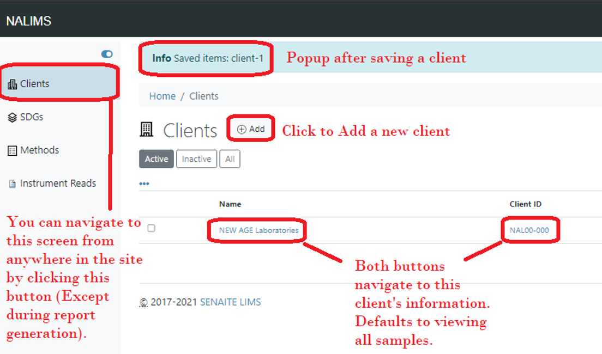

# Standard Operating Procedure - NALIMS: Demos

>Most recently edited by: *Paul VanderWeele*  
>Most recent edit date: *15 Sep 2021*  
>Edits were authorized by:  

## Table of Contents

[Purpose and Scope](#purpose-and-scope)  
[Terms and Definitions](#terms-and-definitions)  

## Purpose and Scope

The purpose of this procedure is to explain how to access and utilize NALIMS software Demos.

## Terms and Definitions

## Access and Credentials

The current NALIMS Demo can be accessed by entering *http://Demo/* into any URL browser while connected to the NEW AGE South Haven office network. It can also be accessed directly by navigating to *http://10.1.10.20:8080* while connected to the network.

The starting credentials for all users is:

Username - First initial of first name followed by entire last name (same as email and network login).
Password - **password**

## Clients

Upon logging in, clicking the **Clients** button on the navigation panel, or selecting **Clients** from any breadcrumbs will navigate to an overview screen of all the Clients in the system.

