# Standard Operating Procedure - NALIMS: Demos

>Most recently edited by: *Paul VanderWeele*  
>Most recent edit date: *15 Sep 2021*  
>Edits were authorized by:  

## Table of Contents

[Purpose and Scope](#purpose-and-scope)  
[Terms and Definitions](#terms-and-definitions)  

## Purpose and Scope

The purpose of this procedure is to explain how to access and utilize NALIMS software Demos.

## Terms and Definitions

## Access and Credentials

The current NALIMS Demo can be accessed by entering *http://Demo/* into any URL browser while connected to the NEW AGE South Haven office network. It can also be accessed directly by navigating to *http://10.1.10.20:8080* while connected to the network.

The starting credentials for all users is:

Username - First initial of first name followed by entire last name (same as email and network login).
Password - **password**

## Clients

### Client Folder

Upon logging in, clicking the **Clients** button on the navigation panel, or selecting **Clients** from any breadcrumbs will navigate to an overview screen of all the Clients in the system.

On this screen, users can search, filter, overview, and create Clients.

Selecting the **[+ADD]** button will prompt users to create a new client.

Selecting either the Client Name or the NAL Account # will navigate users to an overview of the Client's samples with navigation buttons to view, create, and edit various contents of clients.

### Adding a Client

Upon selecting the **[+ADD]** button on the Client Folder, a form screen will be prompted to fill out the new Client's information.

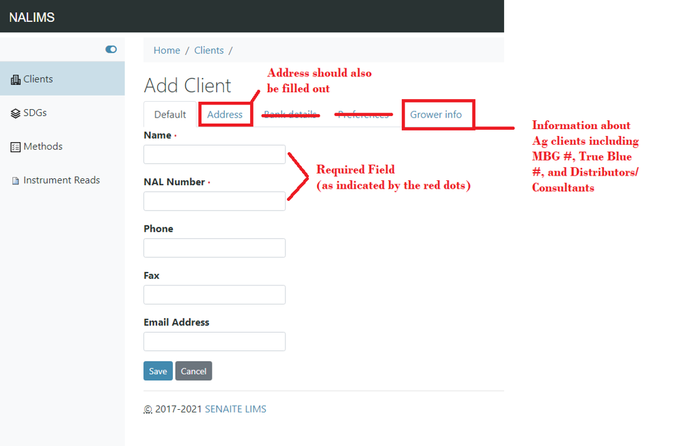

The only required fields are a name and a NAL Account #. The NAL Account # MUST be unique, and the Client will not be accepted otherwise. *Grower Clients* that have sub accounts can be created here using a NALXX-XXX-XX formatted Account #.

At the top of the screen are navigation buttons to modify the Address or Grower Information for the Client.

### Adding a Client - Address

In the NALIMS, address are often captured using a set of Address-related fields. Namely Country, State, District (County), City, and the actual street Address.

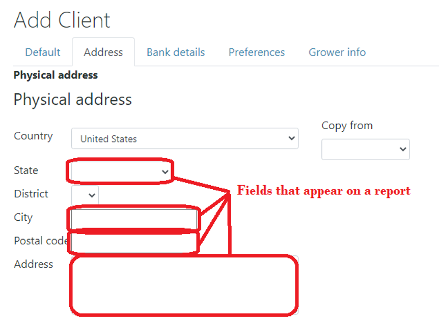

Currently the Country and District (County) do not appear on NAL Certificate of Analyses, however they can still be filled out if that information is available. There are also a few different types of address (Postal, Physical, and Billing). The *Physical* Address should be filled out if only 1 address is given.

### Adding a Client - Grower Information

When adding a Client involved in Agriculture, there is often other information related to who is growing the sample and who is paying for the sample. The 'Grower Info' tab can be used to capture this information in a variety of ways.

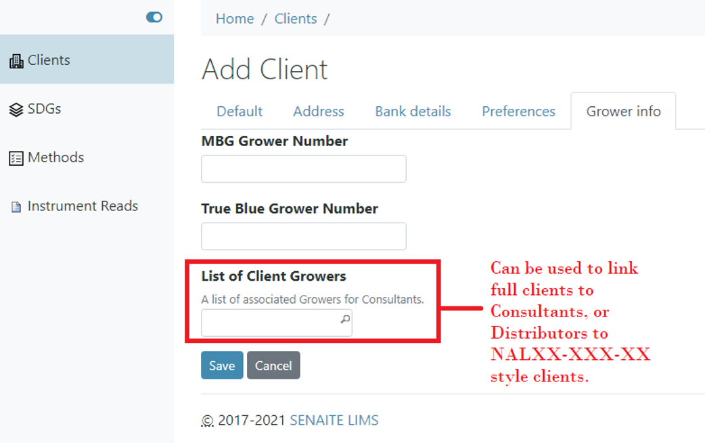

For MBG and TrueBlue growers, their *Grower Number* can be stored her to be referenced and reported. Consulting and Distributing Clients can also have a list of referenced clients with whom they work with.

### Client Contact Listing

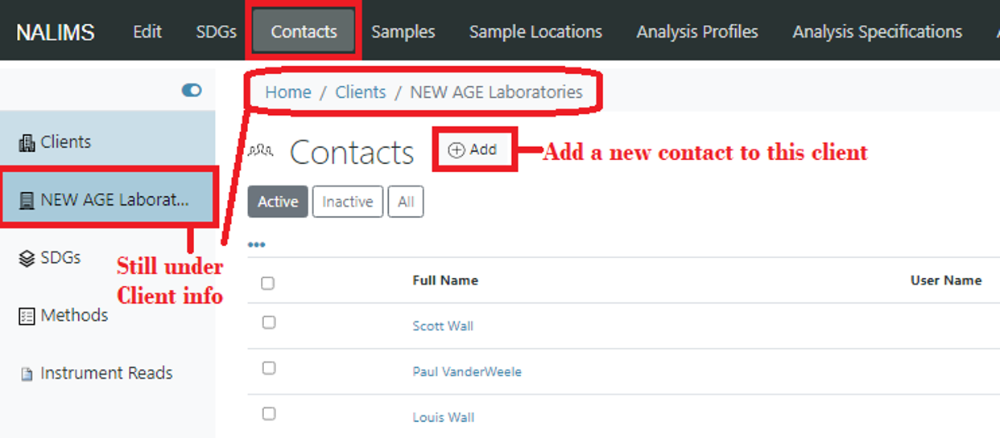

### Add Client Contact

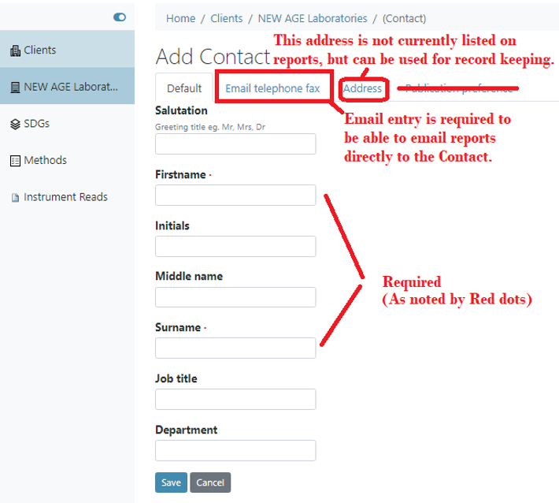

### Add Client Sample Point

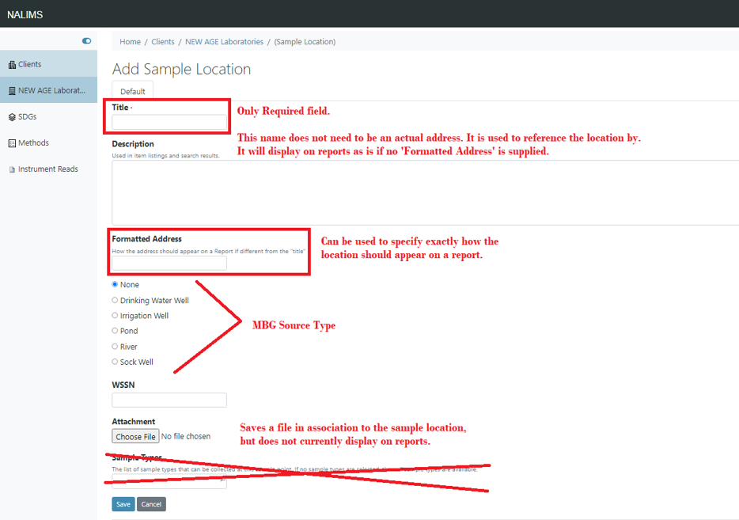

## SDGs

There are two ways SDGs can be created. They can be created *without a Client* which **currently has a bug preventing it from re-adding a client**. They can also be created *for a specific Client* which is the correct way to create an SDG in the NALIMS at this time. **This also has a bug preventing it from re-adding a client**

### Client SDG Overview

To view and create SDGs under a client, first navigate to that client and select the *SDG* tab at the top of the screen. This will bring up a screen listing all of the SDGs under that specific client.

To bring up a form to create the new SDG, select the **[+ADD]** button.

### All SDGs

To view ALL SDGs regardless of Client, select the *SDGs* tab from the navigation menu.

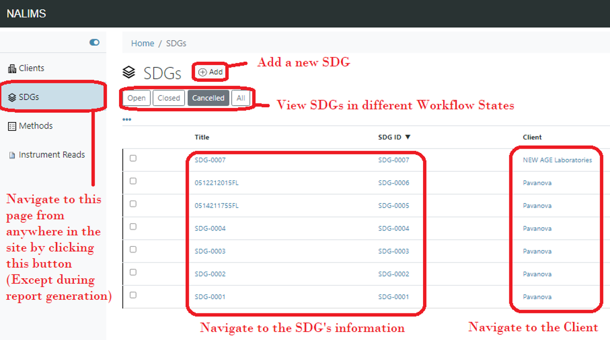

Currently creating an SDG this way has some odd behavior. It is better to create it under the Client themselves. (See Issues on Github)

### Adding an SDG

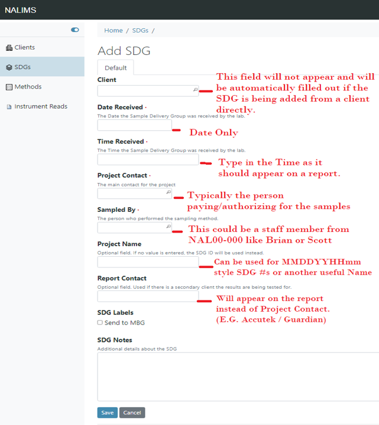

### Sample Listing

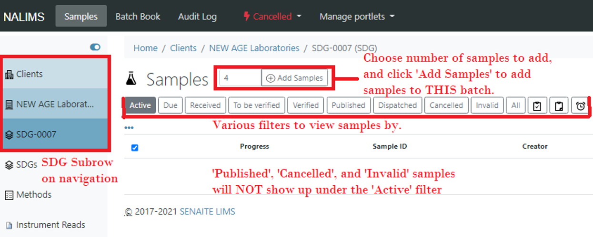

### Add Sample Part 1

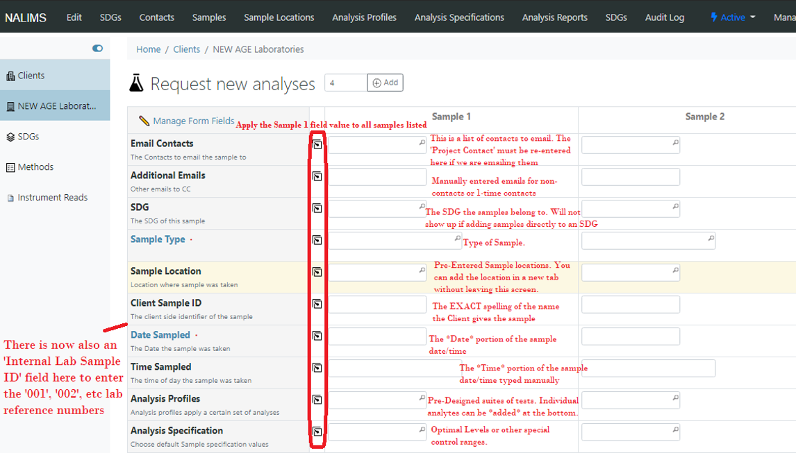

### Add Sample Part 2

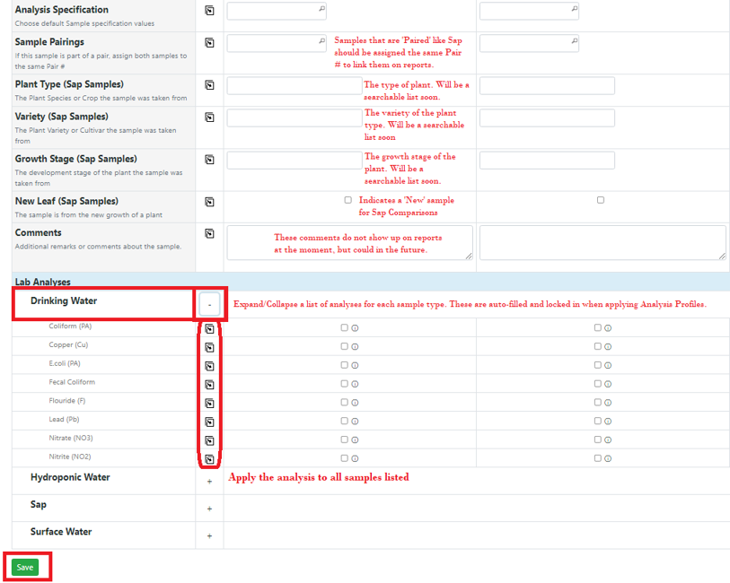

### Sample View

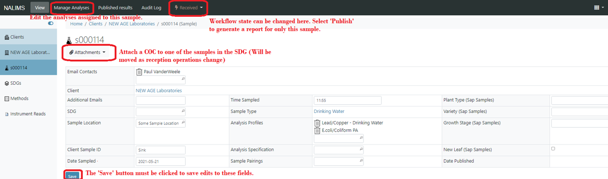

### Sample View Remarks

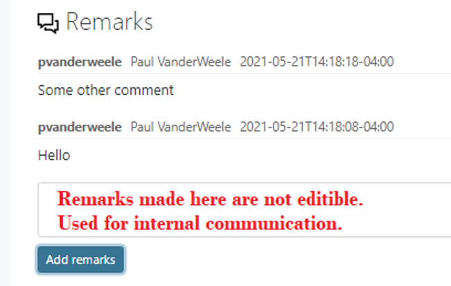

### Sample View Results Save and Submit

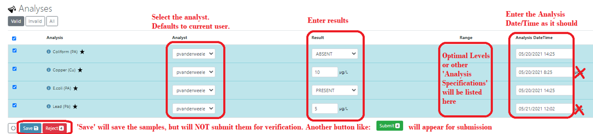

### Sample View Retract Reject and Interpretations

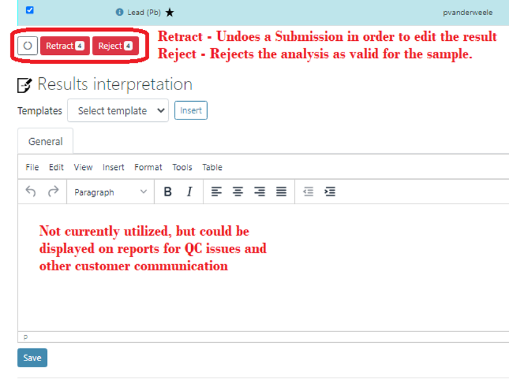

### Sample View Verifying samples

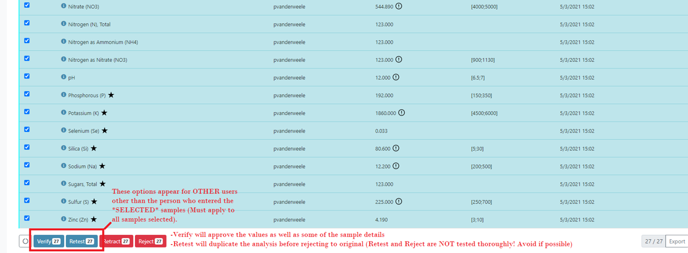

### Publish from SDG Sample Listing

### Reports

