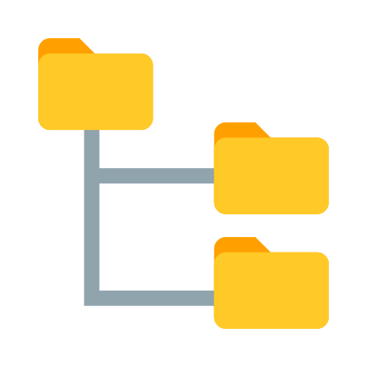
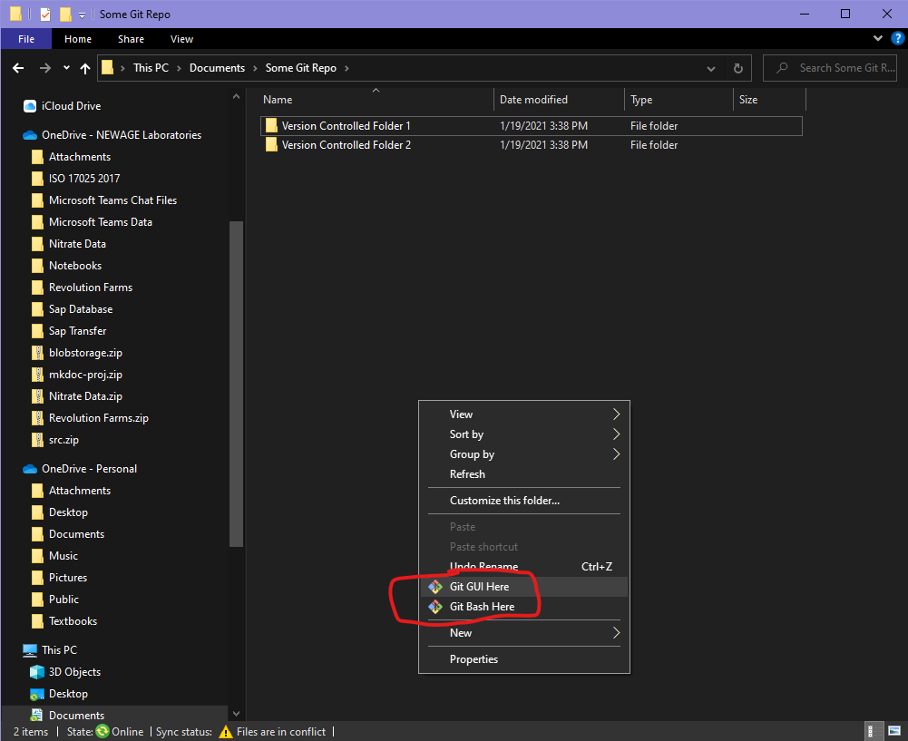
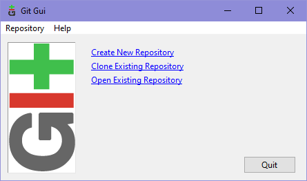
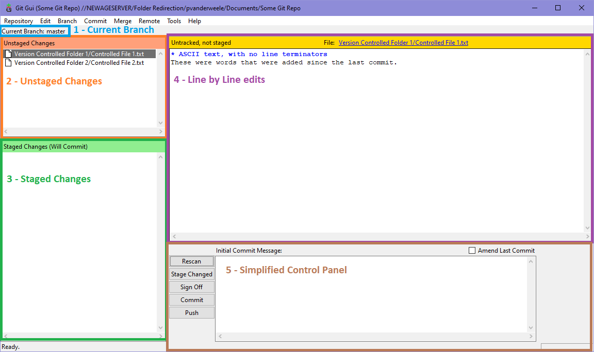

# Standard Operating Procedure - Git

>Most recently edited by: *Paul VanderWeele*  
>Most recent edit date: *Jan 19th, 2021*  
>Edits were authorized by:  

## Table of Contents

[Purpose and Scope](#purpose-and-scope)  
[Terms and Definitions](#terms-and-definitions)  
[How Git Works](#how-git-works)  
[Using Git on BASH](#using-git-on-bash)  
[Using the Git GUI](#using-the-git-gui)

## Purpose and Scope

The purpose of this procedure is to explain how to use the [version control system](#version-control-system) Git to track changes to controlled documents. It includes both an explanation on how Git functions as a tool at an abstract level, and also how to actually perform operations using the Git toolset. When exploring how Git works, most of the information involved can actually be found in a `.git` file located within a repository. Almost all of the information is stored as raw-text, and can be interacted with directly. However, there is also a Git software designed to provide easy tools in manipulating the text.

## Terms and Definitions

A more robust glossary of Git terms can be found on the official [Git Website](https://git-scm.com/docs/gitglossary). The following is a condensed list meant for quick-reference.

###### Repository

> A Repository is a structured set of data typically in a similar folder and file directory format that operating systems use.

###### Version Control System

> A Version Control System is a software system used to track bitwise changes to files, including the ability to reverse and combine changes. Examples include decentralized systems like Git and centralized systems like SVN.

###### Checkout

> A Checkout of a [repository](#repository) links the repository with your file system, and allows modifications to be made. Checkouts are working versions of repositories, and changes made to a checked out repository will take effect immediately.

###### Fork

> A Fork of a [repository](#repository) is a complete copy with the purpose of modifying the repository differently than the original. Forks are effectively a new project based on a previous project.

###### Clone

> A Clone of a [repository](#repository) is a complete copy with the purpose of synchronization. Clones are effectively backups or co-located files of projects.

###### Branch

> A Branch of a [repository](#repository) is a distinct copy of changes to repository files. Branches are used to maintained different variants of a repository that exist in every instance of it.

###### Blob

> A Blob, or 'Binary Large Object' is an object that represents the contents of a file, but without any header information including the file name.

###### Tree

> A Tree is structure represented in graphical format, but can exist in any logical form. A tree is an undirected graph that contains no cycles.
> Git utilizes its own tree structure, often referred to as the 'Git Tree' to represents one level of [repository](#repository) information. It contains information about all the [blobs](#blob) within the directory, metadata and file names, and references to other sub-trees. This allows an entire hierarchy of the repository to be constructed with information about every directory being contained within the directory itself.

###### Commit

> A Commit is an object that represents a set of changes to blobs, and points at one top-level tree that captures the entire [repository](#repository) in one snapshot. It includes information about the author, the time of change, and a log message about the changes. Commits are only made to one [branch](#branch) of one repository at a time.

###### Merge

> A Merge combined the [commits](#commit) from one [branch](#branch) into another, and removes the original branch. If conflicts between the commits exist, they must be resolved before the merge can complete.

###### Origin

> An Origin repository is the original or primary [repository](#repository) of a project, and is sometimes labeled as the "central" repository. While Git is a decentralized [version control system](#version-control-system), it can be used similarly to a centralized version control system by regularly updating the original repository with updates from [clones](#clone).

###### Remote

> In contrast to the [Origin](#origin) [repository](#repository), a Remote repository is NOT the central repository of a project. Remote repositories are often [clones](#clone) of the Origin, used to update different parts of the repository in parallel without conflicting changes. However, remote repositories can also be clones of other remote repositories, allowing for sub-divisions of centralization.

###### Push

> A Push takes the [commits](#commit) from the current [branch](#branch) of the local [repository](#repository) and overwrites a branch on a [remote](#remote) repository. When trying to push to an [origin](#origin) repository, a [pull](#pull) request is used instead.

###### Fetch

> A Fetch gathers the metadata from a [remote](#remote) [repository](#repository) [branch](#branch) and checks it against a local repository branch. Fetching does not modify any files except the .git files.

###### Pull

> A Pull completes the actions described in a [fetch](#fetch). Pulling will overwrite local [repository](#repository) files with the changes described in the identical fetch process. Pulls are typically done by [remote](#remote) repositories and pull from either other remote repositories, or from an [origin](#origin) repository. Instead of [pushing](#push) a change to an origin repository, a Pull Request is made to ask the origin repository to pull from your local repository. This allows the origin to never be accidentally overwritten.

###### Tag

> A Tag is marker to indicate a notable [commit](#commit). Tags are typically used to manage stable, authorized, or remarkable updates, and can utilize various alphanumeric sequencing systems. Additional information on the sequencing systems can be found on the official [Git website](https://git-scm.com/book/en/v2/Git-Basics-Tagging).

###### Rebase

> A rebase is when the base (root) of a branch is moved from one commit to another. Rebasing can have a wide variety of use cases, from troubleshooting a repository itself to substituting for proper branching and merging.

## How Git Works

#### Two Trees

When looking at just one machine's files (or one [repository](#repository)), Git can be viewed as 2 [trees](#tree) that are rooted at the same node. One is the directory tree that the operating system helped create, one is the Git tree used to maintain information about [branches](#branch), [blobs](#blob), and [commits](#commit).

###### The Directory Tree

Since Git must run on top of [Windows](Windows.md) or [Ubuntu](Ubuntu.md), it can utilize the very familiar directory tree structures that exist in both to manage [repositories](#repository).  Each folder is either the root, or a sub-tree of the root. Links and shortcuts connecting folders (which effectively create cycles in the directory tree) can exist, but must be explicitly removed from the [Git tree](#the-git-tree) using a `.gitignore` file.

###### The Git Tree

The above image represents a Git Tree. Each colorful circle represents a individual commit of *an entire repository*, including the entirety of its Directory Tree.

While the [Directory Tree](#the-directory-tree) helps maintain the folder and file structure itself, it does nothing to preserve information between changes to files; that's where the Git Tree comes in. The Git Tree not only maintains information about changes made to folders and files in the form of tracking [Commits](#commit) to [Blobs](#blob), but also maintains various versions of each folder and file in the form of [Branches](#branch).

As indicated by the directed black lines, every commit can be traced back to a commit before it, all the way back to the the Origin Commit (the first commit into the [Origin](#origin)). Because [Merging](#merge) is a forward action, this structure effectively represents a [tree](#tree) structure.

#### Primary Branches

A typical Git repository will consist of two primary [branches](#branch). One for production (authorized) releases which is often labeled **master** because that is the default, and one for development (unauthorized) updates often shorthanded **develop**.

Changes are generally not made directly to the production branch as they would take immediate effect without being authorized. Instead, a development branch is spun off of the production branch, and [commits](#commit) are made there first. Once they are verified and validated to be production-ready, the development branch is then merged into the production branch, and a [tag](#tag) is typically created (but not required).

When working with multiple machines, branches can be merged on a local machine or pushed to a remote repository first depending on which order of operation suits the situation best. However, merging and pushing should be done in two atomic steps, rather than pushing changes of one branch directly into another. This prevents confusion and allows them to be reverted separately should a need arise.

#### Features

Sometimes a large number of changes need to all be made before any of them can be pulled into the master branch of the origin. In these instances it often is easier to manage each changed feature as a separate branch all stemming from the development branch, rather than the master branch.

By separating features out into their own [branches](#branch) and [merging](#merge) them into the development branch first, we can ensure that all the features work **and** work together before introducing any of them into the production system. In the event that features need to be re-designed, this prevents unnecessary updates to the production system, and allows for better system and integration testing.

#### Releases and Tags

Once our planned features are completed, or when we need to hotfix a broken feature of a production system, it's useful to annotate the [commit](#commit_) with a [tag](#tag). Tagging a release allows us to document major milestones, but it *also* allows us to easily revert a repository.

Suppose we add a bunch of new features to a system, and call the release `1.1` and it works perfectly. Then we add more features and call the release `1.2`. Suppose however, despite being reviewed and tested thoroughly, a feature is still broken and not working as designed. We could branch the repository off, fix the feature, and merge it back in with a `1.2.1` as listed in the image above.

However, suppose those fixes will take weeks, and the system is completely broken until then. We could also use the `1.1` tag to revert the repository to the older, stable state while we wait for the `1.2` features to be corrected. For project management clarity, this new tag would ideally still be incremented to `1.2.1` or `1.3`, and the original tag `1.2` would be considered a *broken* release.

## Using Git on BASH

Below are commands used in [BASH](BASH.md) to simplify using Git. The angle brackets < > are used to denote fields that must be replaced with the appropriate info.

#### Initializing a Repository

To initialize a repository, use the command `git init`.

#### Checking Out a Repository

To check out a repository, use the command `git checkout <repo_url>`

#### Cloning a Repository

To clone a repository, use the command `git clone <repo_url>`.
To clone a specific branch of a repository, use the command `git clone -b <branch> <repo_url>`

#### Forking a Repository

To fork a repository, use the command `git fork <repo url>`.

#### Branching

To create or change to a branch in a repository, use the command `git branch <branch>`.

#### Staging Changes

To stage a change to a repository, use the command `git add "<file1>" "<file2>" ...` or `git add -A`.

#### Committing Changes

To commit changes to a repository, use the command `git commit -m "<Log Message>"`.

#### Pushing Changes

To push changes to a repository, use the command `git push <origin/remote name>`.

#### Fetching Changes

To fetch changes from a repository, use the command `git fetch <origin/remote_name>`.

#### Pulling Changes

To pull changes from a repository, use the command `git pull <origin/remote_name>`.

#### Tagging

To tag the current commit, use the command `git tag -a <tag_name> -m "<Tag Comment>"`
To tag a previous commit, use the command `git tag -a <tag_name> <commit>`
To view all tags, use the command `git tag`
To view the latest tag, use the command `git show`
To checkout a tagged commit, use the command `git checkout <tag_name>`

#### Rebasing

To rebase, use the command `git rebase --interactive`

#### Git Log

To view the Git Log, use the command `git log`

#### Git Ignore

To edit the folders and files that Git ignores, modify a `.gitignore` file inside the [Git Tree](#the-git-tree).

#### Git Include

To edit the folders and files that Git includes, modify a `.gitinclude` file inside the [Git Tree](#the-git-tree).

## Using the Git GUI

While Git is best used from a command-line interface like [BASH](BASH.md), a graphical tool does exist for use on [Windows](Windows.md) [Workstations](Workstations.md). To download the tool, navigate to the official [Git Download Website](https://git-scm.com/downloads) and select "*Windows*".

To use the Git GUI, right-click in or on a directory that you would like to manage. Either click `Git GUI Here` to use the GUI, or if using [BASH](BASH.md) select `Git BASH Here` and use the commands listed [above](#using-git-on-bash).

Once the GUI opens, the page displayed could be one of two things. If the folder that was originally selected is NOT already initialized as a Git Repository, then the following menu will be displayed to prompt the user to open one.

Once a repository is selected, or if one was selected to begin with, then the contents of the repository will be scanned, and displayed in the following menu format:

The areas are as follows:

**1 - Current Branch**  
The current branch of the repository being viewed. Additional branches may exist on your local machine, and it's important that commits are made to the correct branch.

**2 - Unstaged Changes**  
When any file or folder that is being tracked by Git is changed, the changed object will appear in this area. These changes will NOT be included in a [commit](#commit) until they are staged. To stage a change, either double click it in the Unstaged Changes section, or select '*Stage Changed*' from the controls in the bottom to stage **ALL** changes listed.

**3 - Staged Changes**  
Listed here are the changes to files and folders that have already been staged. Changes are made on a *bitwise* difference, not an entire file. What this means is that if a staged file is further modified, the newer changes are listed in the **Unstaged Changes** section while the changes selected for staging would remain in the **Staged Changes** section, despite both changes being for the same file.

**4 - Line by Line Edits**  
This section will only display when selecting a staged or unstaged object. The details of the changes will be listed here, indicated by lines that were added and lines that were removed.

**5 - Simplified Control Panel**  
While a full range of tools can be found on the toolbar at the top of the window, this section provides the tools typically used for reviewing and committing changes to an active repository.

* Rescan - Refreshes the program with any new changes that may have occurred within the repository.
* Stage Changes - Stage ALL current Unstaged changes.
* Sign Off - Signs out of the current Git User.
* Commit - Commits all staged changes to the current branch of the local repository
* Push - Pushes the most recent commit of the current branch to a remote repository.
